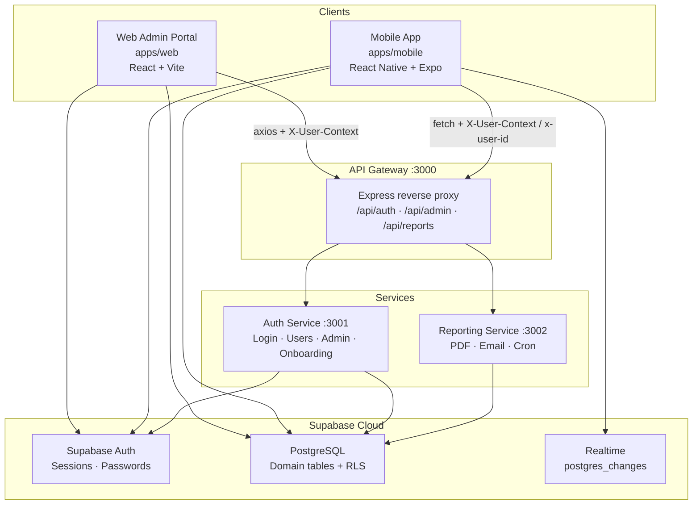
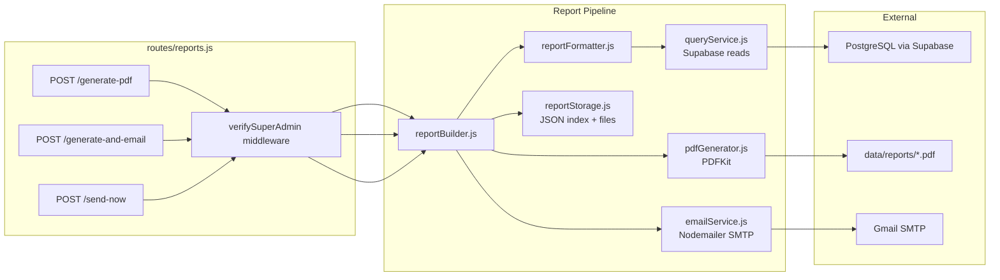
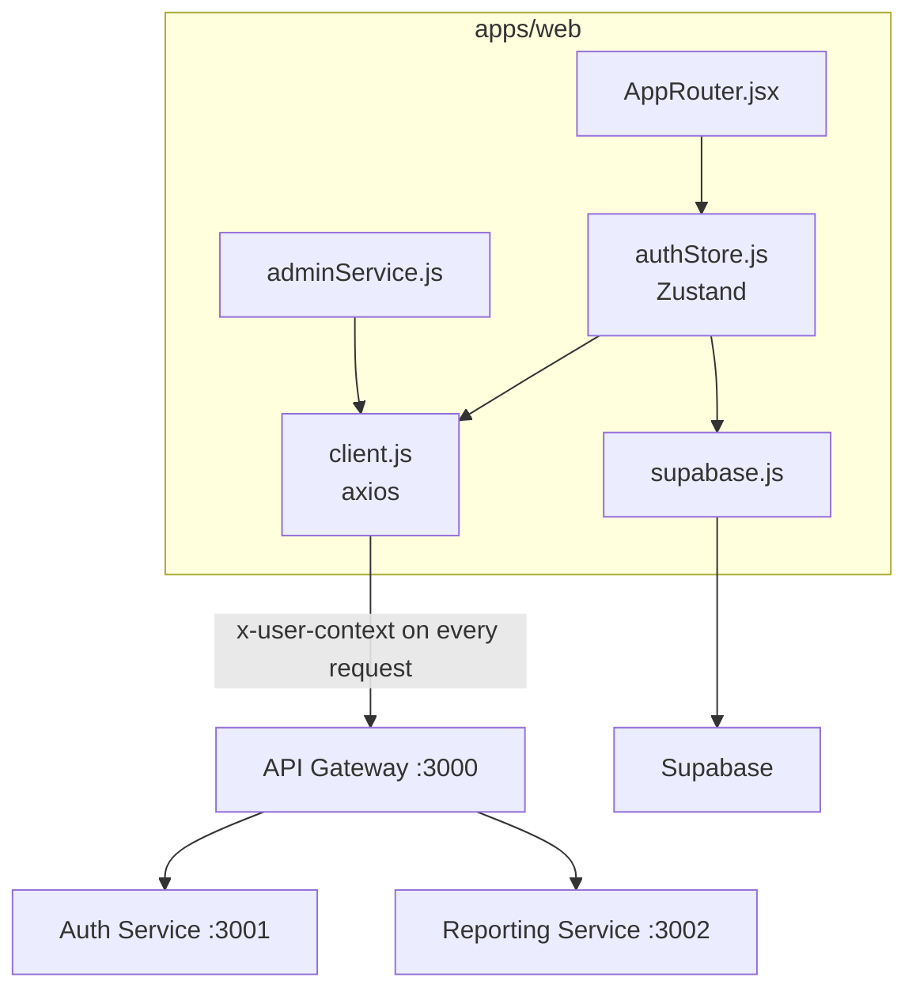
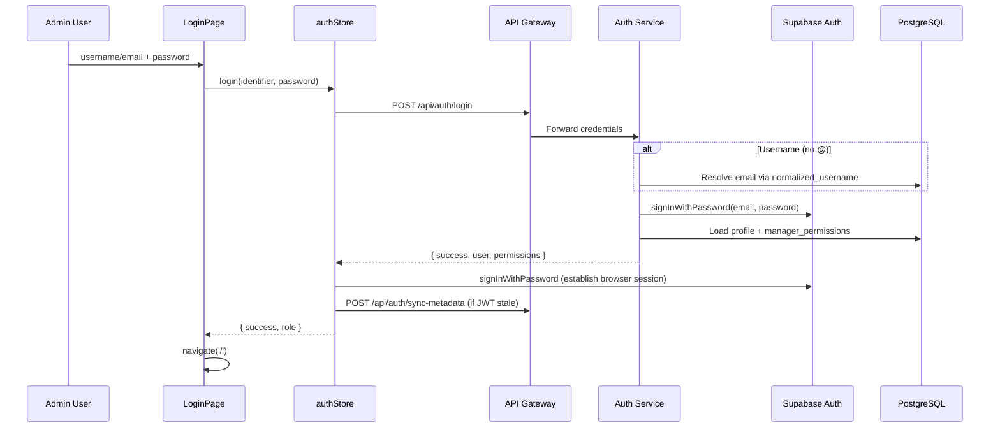
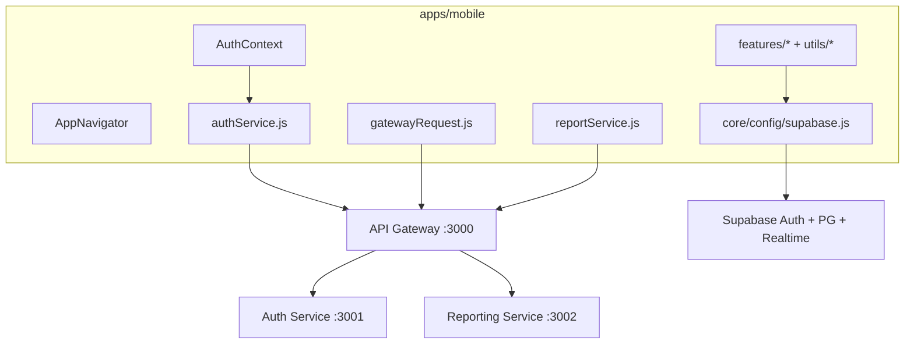
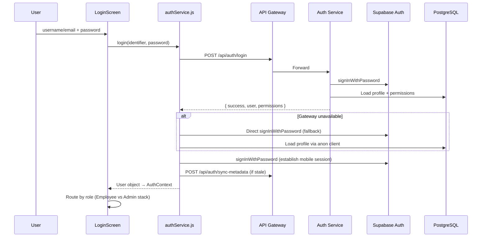
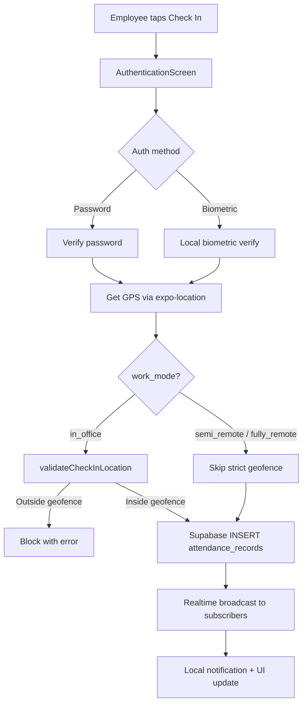

# Hadir.AI — Backend Technical Workflow

**Document:** `docs/BACKEND_TECHNICAL_WORKFLOW.md`  
**Product:** Hadir.AI — Employee Attendance & Workforce Operations Platform  
**Last updated:** 2026-07-03  
**Scope:** End-to-end backend technical workflow for the three client-facing surfaces — **Reporting Service**, **Web Admin Portal**, and **Mobile App** — including how they connect to shared backend infrastructure, Supabase, and each other.

---

## Table of Contents

1. [Platform Context](#1-platform-context)
2. [High-Level Architecture](#2-high-level-architecture)
3. [Shared Backend Infrastructure](#3-shared-backend-infrastructure)
4. [Reporting Service — Technical Workflow](#4-reporting-service--technical-workflow)
5. [Web Admin Portal — Backend Integration Workflow](#5-web-admin-portal--backend-integration-workflow)
6. [Mobile App — Backend Integration Workflow](#6-mobile-app--backend-integration-workflow)
7. [Cross-Service Data Flows](#7-cross-service-data-flows)
8. [Authentication & Identity Propagation](#8-authentication--identity-propagation)
9. [Multi-Tenant Isolation Model](#9-multi-tenant-isolation-model)
10. [Environment Configuration](#10-environment-configuration)
11. [Local Development & Service Startup](#11-local-development--service-startup)
12. [Production Deployment Workflow](#12-production-deployment-workflow)
13. [Operational Runbook](#13-operational-runbook)
14. [Error Handling & Fallback Patterns](#14-error-handling--fallback-patterns)
15. [Appendix: Complete API Route Index](#15-appendix-complete-api-route-index)

---

## 1. Platform Context

Hadir.AI is a **multi-tenant workforce operations platform**. Each company (tenant) has employees, managers, and a super admin. The platform handles attendance (GPS + geofencing), leave management, support tickets, calendar events, notifications, and PDF reporting.

### Three Client Surfaces Covered in This Document

| Surface | Code path | Primary users | Backend access pattern |
|---------|-----------|---------------|------------------------|
| **Reporting Service** | `services/reporting-service` | Super admins (via web or mobile) | Standalone Express service on port **3002**; queries Supabase with service role; generates PDFs and sends email |
| **Web Admin Portal** | `apps/web` | Managers and super admins | HTTP via **API Gateway :3000** for admin mutations; Supabase direct for session and RLS reads |
| **Mobile App** | `apps/mobile` | Employees, managers, super admins | HTTP via **API Gateway :3000** for privileged auth/admin routes; Supabase direct for attendance, geofencing, notifications, and most CRUD |

### Design Principles

- **Supabase PostgreSQL** is the source of truth for all domain data.
- **Supabase Auth** holds credentials and browser/mobile sessions (JWT).
- **API Gateway** is the single public HTTP entry point for backend services.
- **Auth Service** enforces tenant scope, role checks, and business rules server-side using the Supabase **service role key**.
- **Reporting Service** is read-only against domain tables; it never mutates attendance, leave, or ticket records.
- **Employees** use the mobile app only; they do not access the web portal.
- **Managers** are department-scoped by default unless granted tenant-wide permissions via `manager_permissions`.
- **Super admins** have full tenant access and are the only role that can trigger reports.

---

## 2. High-Level Architecture



### Request Path Summary

| Operation type | Typical path |
|----------------|--------------|
| Login | Client → Gateway → Auth Service → Supabase Auth |
| Admin CRUD (users, departments, leaves) | Client → Gateway → Auth Service → PostgreSQL (service role) |
| Report generation | Client → Gateway → Reporting Service → PostgreSQL (read) → PDF file → SMTP email |
| Check-in / attendance | Client → Supabase direct (anon key + user JWT, RLS enforced) |
| Realtime attendance updates | Client → Supabase Realtime subscription |

The gateway performs **no authentication**. It forwards identity headers (`X-User-Context`, `x-user-id`, `x-user-email`, `Authorization`) to downstream services unchanged.

---

## 3. Shared Backend Infrastructure

Before diving into each client surface, the three backend services that all clients depend on are documented here.

### 3.1 API Gateway (`services/api-gateway`)

**Entry point:** `services/api-gateway/index.js`  
**Default port:** `3000`

#### Responsibilities

- CORS, JSON body parsing, request logging (passwords redacted in logs)
- Reverse proxy to Auth Service and Reporting Service via Axios
- Forward client identity headers without modification
- Health check with build SHA for deployment verification

#### Route Mounts

| Gateway prefix | Downstream target | Timeout |
|----------------|-------------------|---------|
| `/api/auth/*` | Auth Service `/api/auth/*` | 10s (30s for onboard-company) |
| `/api/admin/*` | Auth Service `/api/admin/*` | 10s |
| `/api/reports/*` | Reporting Service `/api/reports/*` | 120s (PDF generation) |

#### Environment Variables

| Variable | Default | Purpose |
|----------|---------|---------|
| `PORT` | `3000` | Listen port |
| `HOST` | `0.0.0.0` | Bind address |
| `AUTH_SERVICE_URL` | `http://localhost:3001` | Auth backend URL |
| `REPORTING_SERVICE_URL` | `http://localhost:3002` | Reporting backend URL |

The gateway has **no Supabase client** and no business logic.

---

### 3.2 Auth Service (`services/auth-service`)

**Entry point:** `services/auth-service/index.js`  
**Default port:** `3001`

#### Responsibilities

- User login (username or email resolution → Supabase Auth)
- User CRUD with tenant isolation and permission checks
- Company onboarding (first tenant bootstrap + multi-tenant gate)
- Admin dashboard, analytics, departments, sites, attendance, leaves
- Manager permission management and audit logging
- JWT metadata sync (`user_metadata` aligned with `public.users`)

#### Route Modules

| Module | Mount | Purpose |
|--------|-------|---------|
| `routes/auth.js` | `/api/auth` | Login, users, sync-metadata, departments |
| `routes/onboarding.js` | `/api/auth` | Company onboarding |
| `routes/admin.js` | `/api/admin` | All admin governance endpoints |

#### Security Model

1. **Identity via `X-User-Context`:** Clients send a JSON header with `{ uid, role, company_id, department, username }`. Auth Service parses this via `parseRequester()` / `withTenantContext()`.
2. **Tenant pinning:** `company_id` is never trusted from request bodies. It is always derived from the requester's profile in `public.users`.
3. **Permission checks:** Managers require explicit grants in `manager_permissions`. Super admins bypass all checks.
4. **Service role writes:** Privileged mutations use `@supabase/supabase-js` with `SUPABASE_SERVICE_ROLE_KEY`, bypassing RLS.
5. **Self-protection:** Users cannot modify their own admin access (`rejectSelfAdministrativeChange()`).
6. **Admin password reset disabled:** Admin-initiated password changes return `403`; users change passwords in the mobile app.

#### Key Library Modules

| Module | Path | Responsibility |
|--------|------|----------------|
| `loginNormalize.js` | `lib/` | Email/username normalization for login |
| `permissions.js` | `lib/` | Permission groups, `requirePermission`, audit logging |
| `tenantScope.js` | `lib/` | Company isolation helpers |
| `profileAccess.js` | `lib/` | Department vs tenant-wide user edit rules |
| `authMetadata.js` | `lib/` | Sync JWT `user_metadata` from DB |
| `departmentService.js` | `lib/` | Department list/ensure per company |
| `usernameUpdate.js` | `lib/` | Username uniqueness + auth sync |

#### Environment Variables

| Variable | Required | Purpose |
|----------|----------|---------|
| `SUPABASE_URL` | Yes | Supabase project URL |
| `SUPABASE_SERVICE_ROLE_KEY` | Yes | Service role JWT (validated at startup) |
| `COMPANY_ONBOARDING_SECRET` | Yes after 1st company | Gate for additional tenant creation |
| `PORT` | No (3001) | Listen port |

---

## 4. Reporting Service — Technical Workflow

**Entry point:** `services/reporting-service/index.js`  
**Default port:** `3002`  
**Code path:** `services/reporting-service/`

The Reporting Service generates PDF workforce reports from attendance, leave, and ticket data stored in Supabase. It emails reports to super admins and runs a scheduled monthly job per company.

### 4.1 Service Bootstrap

On startup the service:

1. Loads environment variables from `.env`
2. Mounts Express routes at `/api/reports`
3. Starts the **monthly report cron job** (`jobs/monthlyReportJob.js`)
4. Starts a **cleanup interval** every 5 minutes to delete expired report files (7-day retention)

```
index.js startup
  ├── express + cors + json middleware
  ├── app.use('/api/reports', reportRoutes)
  ├── GET /health
  ├── startMonthlyReportJob()     → cron: 0 2 * * * UTC
  └── setInterval(cleanup, 5min)  → delete reports older than 7 days
```

### 4.2 Architecture Within the Service



### 4.3 Authentication & Authorization

All report routes except `GET /health` pass through `verifySuperAdmin` middleware.

#### Identity Resolution (in order)

1. `x-user-id` header
2. `x-user-email` header
3. `x-user-context` JSON header (fallback: extract `uid`/`id` and `email`)

#### Verification Steps

```
1. Parse identity from headers
2. Query public.users WHERE is_active = true
   - Prefer email lookup if x-user-email present
   - Else match uid or id column
3. Verify role === 'super_admin'
4. Verify company_id is present (tenant scope)
5. Attach req.user → proceed to handler
```

Only **super admins** of a tenant can generate, download, email, or schedule reports for that tenant. Managers and employees receive `403 Forbidden`.

### 4.4 API Endpoints

| Method | Path | Purpose | Response |
|--------|------|---------|----------|
| `POST` | `/generate-pdf` | Generate PDF, store locally, no email | JSON with `reportId`, metadata |
| `POST` | `/generate-and-email` | Generate PDF + email super admins | JSON with `emailStatus` |
| `POST` | `/generate` | Legacy alias for generate-pdf | Same as generate-pdf |
| `GET` | `/preview/:reportId` | Stream PDF inline in browser | Binary PDF |
| `GET` | `/download/:reportId` | Stream PDF as attachment | Binary PDF |
| `POST` | `/email/:reportId` | Email an existing stored report | JSON |
| `GET` | `/history` | List all reports for caller's company | JSON array |
| `GET` | `/latest` | Most recent report for company | JSON |
| `DELETE` | `/:reportId` | Delete report record + PDF file | JSON |
| `GET` | `/recipients` | Super admin emails for tenant | JSON array |
| `GET` | `/schedule` | Current schedule settings | JSON |
| `PUT` | `/schedule` | Update schedule (day, autoSend, frequency) | JSON |
| `POST` | `/send-now` | Async trigger monthly report (bypasses schedule) | HTTP 202 |
| `GET` | `/health` | Service health (no auth) | JSON |

#### Request Body for Generation Routes

```json
{
  "range": "monthly",
  "from": "2026-01-01T00:00:00.000Z",
  "to": "2026-03-31T23:59:59.999Z"
}
```

| `range` value | Date window |
|---------------|-------------|
| `daily` | Previous calendar day |
| `weekly` | Previous 7 days |
| `monthly` | Previous calendar month |
| `yearly` | Previous calendar year |
| `all` | All historical records |
| `custom` | Requires both `from` and `to` ISO dates |

### 4.5 Report Generation Pipeline (Step by Step)

```
1. Client sends POST /api/reports/generate-pdf (via gateway)
2. verifySuperAdmin resolves req.user (super_admin + company_id)
3. validateRangeBody checks range and custom dates
4. buildReport({ companyId, range, from, to, generatedBy })
   │
   ├── generateReportData()          [reportFormatter.js]
   │     ├── Query users by company_id
   │     ├── Query attendance_records in date range
   │     ├── Query leave_requests in date range
   │     ├── Query tickets in date range
   │     └── Aggregate per-department statistics
   │
   ├── generatePDF()                 [pdfGenerator.js — PDFKit]
   │     ├── Company branding (name, logo fetch)
   │     ├── Summary KPIs
   │     ├── Department-wise breakdown
   │     └── Attendance / leave / ticket sections
   │
   ├── savePDFToFile()               [data/reports/{reportId}.pdf]
   │
   └── storeReport()                 [reportStorage.js — JSON index]
         └── Metadata: reportId, companyId, periodLabel, fileSize, createdAt, expiresAt
5. [Optional] sendReportEmail()       [emailService.js]
   └── Recipients: getSuperAdminEmails(companyId)
6. Return JSON response to client
```

#### Success Response Shape

```json
{
  "success": true,
  "reportId": "uuid",
  "periodLabel": "March 2026",
  "fileSize": 45678,
  "durationMs": 1200,
  "emailStatus": "sent",
  "report": {
    "id": "uuid",
    "periodLabel": "March 2026",
    "range": "monthly",
    "createdAt": "2026-04-01T02:00:05.000Z",
    "expiresAt": "2026-04-08T02:00:05.000Z"
  }
}
```

Public metadata never includes internal `filePath`.

### 4.6 Scheduled Monthly Report Job

**File:** `jobs/monthlyReportJob.js`  
**Cron expression:** `0 2 * * *` (daily at 02:00 UTC)

The job runs every day but only sends when conditions match per company:

```
For each company in companies table:
  1. Read report_auto_send (boolean) and report_schedule_day (1–28) from companies row
  2. If report_auto_send === false → skip
  3. If today's UTC day-of-month !== report_schedule_day → skip
  4. Call triggerReportForCompany(companyId)
     └── buildReport with range=monthly for previous calendar month
     └── Email all active super_admin users for that company
```

**Send Now (`POST /send-now`):** Bypasses the schedule check. Returns HTTP 202 immediately and runs generation asynchronously for the caller's `company_id`.

### 4.7 Email Delivery

**File:** `services/emailService.js`

| Setting | Source |
|---------|--------|
| SMTP host | `SMTP_HOST` (default `smtp.gmail.com`) |
| SMTP port | `SMTP_PORT` (default `587`) |
| Credentials | `SMTP_USER`, `SMTP_PASS` |
| From address | `EMAIL_FROM` or `SMTP_USER` |

**Recipients:** Resolved dynamically via `getSuperAdminEmails(companyId)` — active users with `role = 'super_admin'` in the caller's tenant. Prefers `report_email` column over `email` when set. No global env-var recipient overrides (prevents cross-tenant leaks).

### 4.8 Report Storage & Retention

| Component | Location | Purpose |
|-----------|----------|---------|
| PDF files | `services/reporting-service/data/reports/{reportId}.pdf` | Binary output |
| Metadata index | `services/reporting-service/data/reports-index.json` | Report catalog per company |
| Retention | 7 days (`REPORT_RETENTION_MS`) | Auto-cleanup every 5 minutes |

`verifyReportAccess(reportId, companyId)` ensures a super admin can only download reports belonging to their tenant.

### 4.9 Supabase Tables Queried (Read-Only)

| Table | Data used in reports |
|-------|---------------------|
| `users` | Employee counts, department distribution, super admin emails |
| `companies` | Branding, schedule settings (`report_auto_send`, `report_schedule_day`) |
| `attendance_records` | Check-in/out counts, punctuality, department stats |
| `leave_requests` | Pending/approved/rejected counts by type |
| `tickets` | Open/resolved counts by category and priority |
| `report_audit_logs` | Generation audit trail |

### 4.10 Environment Variables

| Variable | Default | Purpose |
|----------|---------|---------|
| `PORT` | `3002` | Listen port |
| `HOST` | `0.0.0.0` | Bind address |
| `SUPABASE_URL` | — | Supabase project URL |
| `SUPABASE_SERVICE_ROLE_KEY` | — | Service role key for DB reads |
| `SMTP_HOST` | `smtp.gmail.com` | Email server |
| `SMTP_PORT` | `587` | Email port |
| `SMTP_USER` | — | SMTP username |
| `SMTP_PASS` | — | SMTP password (app password) |
| `EMAIL_FROM` | `SMTP_USER` | From address override |

---

## 5. Web Admin Portal — Backend Integration Workflow

**Code path:** `apps/web/`  
**Package name:** `hadir-admin-web`  
**Primary users:** Managers and super admins only

The web portal is a React + Vite SPA. It does not run server-side logic. All backend interaction happens through the API Gateway (admin mutations) and Supabase JS client (session, bootstrap reads).

### 5.1 Backend Connection Architecture



### 5.2 Application Bootstrap Sequence

```
main.jsx
  └── AppRouter
        └── useEffect → authStore.bootstrap()
              ├── supabase.auth.getSession()
              ├── if session: SELECT public.users WHERE uid = session.user.id
              ├── if JWT metadata stale: POST /api/auth/sync-metadata (Bearer token)
              ├── if manager: SELECT manager_permissions WHERE manager_uid = uid
              └── set user in Zustand store → render protected routes
```

**Key files:**
- `src/features/auth/store/authStore.js` — login, logout, bootstrap
- `src/core/auth/syncTenantMetadata.js` — metadata sync trigger
- `src/core/auth/tenantClaims.js` — stale claim detection

### 5.3 Login Workflow



**Post-login access rules:**

| Role | Web portal |
|------|------------|
| `employee` | Blocked — mobile app only |
| `manager` | Allowed — routes filtered by `manager_permissions` |
| `super_admin` | Full access to all routes |

### 5.4 HTTP Client & Identity Header

**File:** `src/core/api/client.js`

Every axios request automatically attaches:

```json
{
  "uid": "<supabase-auth-uid>",
  "username": "techmanager",
  "email": "manager@company.com",
  "role": "manager",
  "department": "Technical",
  "companyId": "uuid",
  "company_id": "uuid",
  "departmentId": "uuid",
  "permissions": ["view_employees", "approve_leave"]
}
```

Header name: `x-user-context` (JSON stringified from `authStore.user`).

**Guards:**
- Throws if `VITE_API_GATEWAY_URL` is missing in production
- Blocks localhost gateway URLs outside `import.meta.env.DEV`
- Default timeout: 10 seconds (reports use 120 seconds)

### 5.5 Admin Service Layer

**File:** `src/features/admin/services/adminService.js`

Central facade for all portal backend calls:

| Domain | Methods | Gateway endpoints |
|--------|---------|-------------------|
| Dashboard | `getStats()` | `GET /api/admin/dashboard/stats` |
| Analytics | `getAnalytics()` | `GET /api/admin/analytics` |
| Users | `getUsers`, `createUser`, `updateUser`, `updateUserRole` | `/api/admin/users*`, `/api/auth/users*` |
| Departments | `getDepartments`, `createDepartment`, `renameDepartment`, `deleteDepartment` | `/api/admin/departments/*` |
| Sites | `getSites`, `createSite`, `assignEmployeeSite` | `/api/admin/sites`, `/api/admin/employee-sites` |
| Attendance | `getAttendance()` | `GET /api/admin/attendance` |
| Leaves | `getLeaves()`, `processLeave(id, { status })` | `GET/PATCH /api/admin/leaves/*` |
| Permissions | `getManagers`, `getManagerPermissions`, `updateManagerPermissions` | `/api/admin/managers/*` |
| Audit | via permissions page | `GET /api/admin/audit-logs` |
| **Reports** | See section 5.6 | `/api/reports/*` |

All admin mutations go through the gateway. The portal does **not** write directly to PostgreSQL for privileged operations.

### 5.6 Reports Page Backend Workflow

**Route:** `/reports`  
**Page:** `src/features/admin/pages/ReportsPage.jsx`  
**Permission required:** `export_reports`  
**Access:** Super admins (permission check) — backend also enforces super_admin role

#### Generate PDF (on-demand)

```
User selects range (daily/weekly/monthly/yearly/all/custom)
  → adminService.generateReportPdf({ range, from?, to? })
  → POST /api/reports/generate-pdf (120s timeout)
  → Gateway → Reporting Service
  → verifySuperAdmin (via x-user-context)
  → buildReport pipeline
  → Response: { reportId, periodLabel, fileSize, ... }
  → UI shows download/preview/email actions
```

#### Generate and Email

```
adminService.generateReportAndEmail(payload)
  → POST /api/reports/generate-and-email
  → Same pipeline + sendReportEmail to all tenant super admins
```

#### Download / Preview

```
adminService.getReportDownloadUrl(reportId)
  → Absolute URL: {gateway}/api/reports/download/{reportId}
  → Browser opens/downloads PDF (gateway streams binary)

adminService.getReportPreviewUrl(reportId)
  → {gateway}/api/reports/preview/{reportId}
  → Inline PDF in browser tab
```

#### Report History & Management

| Action | Method | Endpoint |
|--------|--------|----------|
| List history | `GET` | `/api/reports/history` |
| Latest report | `GET` | `/api/reports/latest` |
| Email existing | `POST` | `/api/reports/email/:reportId` |
| Delete report | `DELETE` | `/api/reports/:reportId` |
| List recipients | `GET` | `/api/reports/recipients` |

#### Schedule Management

| Action | Method | Endpoint |
|--------|--------|----------|
| View schedule | `GET` | `/api/reports/schedule` |
| Update schedule | `PUT` | `/api/reports/schedule` |
| Send now | `POST` | `/api/reports/send-now` |

Schedule body example:

```json
{
  "day": 1,
  "autoSend": true,
  "frequency": "monthly"
}
```

Default: 1st of each month at 02:00 UTC (when cron conditions match).

### 5.7 Feature Page → Backend Mapping

| Route | Page | Primary API calls | Polling |
|-------|------|-------------------|---------|
| `/` | DashboardPage | `getStats`, optional `getUsers`, `getLeaves` | None |
| `/users` | UsersPage | `getUsers`, `createUser`, `updateUser`, `updateUserRole` | None |
| `/departments` | DepartmentsPage | `getDepartmentsOverview`, department CRUD | None |
| `/attendance` | AttendancePage | `getAttendance` | 30 seconds |
| `/leaves` | LeavesPage | `getLeaves`, `processLeave` | 30 seconds |
| `/tickets` | TicketsPage | Supabase direct + admin scope | — |
| `/sites` | SitesPage | `getSites`, `createSite`, `assignEmployeeSite` | None |
| `/calendar` | CalendarPage | Supabase direct (`calendar_events`) | None |
| `/analytics` | AnalyticsPage | `getAnalytics` (fallback: client-side aggregation) | None |
| `/reports` | ReportsPage | All `/api/reports/*` endpoints | None |
| `/notifications` | NotificationsPage | Supabase direct (`notifications`) | None |
| `/settings` | SettingsPage | `getDepartmentsOverview`, `getUsers` | None |
| `/manager-permissions` | ManagerPermissionsPage | `/api/admin/managers/*`, audit logs | None |

### 5.8 Permission Gating (Frontend + Backend)

**Frontend:** `src/features/admin/permissions.js`

- `canAccessFeature(user, featureKey)` — route-level gate via `PermissionRoute`
- `hasPermission(user, key)` — super_admin always true; else check `user.permissions`
- `<PermissionGate permission="...">` — component-level action hiding

**Backend:** Auth Service re-validates every request independently. Frontend gating is UX only; security is enforced server-side.

### 5.9 Supabase Direct Access (Web)

The portal uses Supabase JS (anon key + user JWT) for:

| Operation | When |
|-----------|------|
| `getSession()` | Bootstrap |
| `signInWithPassword` | After gateway login |
| `signOut` | Logout |
| `users` SELECT | Bootstrap, fallback login |
| `manager_permissions` SELECT | Bootstrap, fallback login |

Admin mutations never bypass the gateway.

### 5.10 Gateway Fallback Login

If the API Gateway is unreachable at login time:

1. Resolve email (direct or via Supabase `users` lookup)
2. `supabase.auth.signInWithPassword`
3. Load `public.users` profile
4. Fetch `manager_permissions` directly from Supabase

This allows local development when only Supabase is reachable.

### 5.11 Environment Variables

```env
VITE_API_GATEWAY_URL=https://<gateway-host>
NEXT_PUBLIC_API_URL=https://<gateway-host>    # alternate, Vercel compatibility
VITE_SUPABASE_URL=https://<project>.supabase.co
VITE_SUPABASE_ANON_KEY=<anon-key>
```

Env vars are baked at **build time** (Vite). Changing them requires a redeploy.

---

## 6. Mobile App — Backend Integration Workflow

**Code path:** `apps/mobile/`  
**Framework:** React Native + Expo SDK ~54  
**Primary users:** Employees (field operations), managers, super admins

The mobile app uses a **hybrid data access model**: most domain operations go directly to Supabase (RLS-enforced), while privileged admin and reporting operations go through the API Gateway.

### 6.1 Backend Connection Architecture



### 6.2 App Bootstrap

**File:** `App.js`

```
1. Import react-native-gesture-handler (first)
2. Wrap: AuthProvider → ThemeProvider → CompanyProvider
3. Mount AppNavigator
4. Production cold start: checkForOTAUpdate() via expo-updates
5. clearLegacyDummyEmployeeCache()
```

**AuthContext** (`contexts/AuthContext.js`) holds the authenticated user, permissions, and login/logout methods. On auth change, **CompanyContext** loads company branding from Supabase `companies` table.

### 6.3 API Gateway URL Resolution

**File:** `core/config/api.js`

| Environment | URL source |
|-------------|------------|
| Production (EAS build) | `Constants.expoConfig.extra.apiGatewayUrl` |
| iOS Simulator | `http://localhost:3000` |
| Android Emulator | `http://10.0.2.2:3000` |
| Physical device | LAN IP configured in `app.json` extra |

Configured in `app.json`:

```json
{
  "expo": {
    "scheme": "hadirai",
    "extra": {
      "apiGatewayUrl": "https://<render-gateway-url>",
      "supabaseRedirectUrl": "hadirai://reset-password"
    }
  }
}
```

### 6.4 Login Workflow



**Post-login routing:**

| Role | Navigation destination |
|------|------------------------|
| `employee` | `EmployeeDashboard` (DrawerNavigator) |
| `manager` | `AdminDashboard` + permission-gated screens |
| `super_admin` | `AdminDashboard` (full access) |

### 6.5 Gateway Request Helper

**File:** `core/api/gatewayRequest.js`

Used for privileged Auth Service routes (user CRUD, departments, org APIs):

```javascript
// Headers sent on privileged mutations
{
  'Content-Type': 'application/json',
  'X-User-Context': JSON.stringify({
    uid, role, company_id, companyId, department, username
  })
}
```

**`resolveCurrentRequester()`:** Reads active Supabase session → loads `public.users` row → normalizes via `toRequesterContext()` → validates `company_id` via `requireValidCompanyId()`.

**Used by:**
- `utils/auth.js` — create/update/delete users
- `core/api/tenantOrgApi.js` — departments, position suggestions
- `utils/leaveManagement.js`, `utils/ticketManagement.js` — requester resolution

### 6.6 Data Access Split: Gateway vs Supabase Direct

| Domain | Access path | Why |
|--------|-------------|-----|
| Check-in / check-out | Supabase INSERT (`attendance_records`) | Realtime, RLS, low latency |
| Geofencing | Supabase RPCs + direct reads | Location-sensitive, offline cache |
| Notifications | Supabase + AsyncStorage cache | Realtime + offline badge |
| Calendar events | Supabase direct | RLS visibility rules |
| Leave submission | Supabase INSERT | Employee self-service |
| Ticket creation | Supabase INSERT | Employee self-service |
| User CRUD | Gateway → Auth Service | Service role, permission checks |
| Department list (manage) | Gateway → Auth Service | Scoped admin read |
| Report generation | Gateway → Reporting Service | PDF pipeline, super_admin only |
| Company branding | Supabase direct read | Simple tenant-scoped read |

### 6.7 Attendance Backend Workflow

Attendance is the most frequent mobile operation and does **not** go through the gateway.



**Automatic checkout:** `locationMonitoringService.js` polls GPS for `in_office` users who are checked in. On geofence exit (when enabled) → auto check-out record + notification.

**Manual attendance (managers):** `ManualAttendanceScreen` inserts with `is_manual: true`, `created_by` set to operator UID. Scoped by department permissions.

### 6.8 Leave Management Backend Workflow

**Submission (employee):**
```
LeaveRequestScreen
  → INSERT leave_requests (status: pending, company_id scoped)
  → Notification to department manager + super admins (Supabase notifications table)
```

**Approval (manager/super admin):**
```
HRDashboard or Web /leaves
  → PATCH /api/admin/leaves/:id { status: approved|rejected }
  → Auth Service validates approve_leave / reject_leave permission
  → Updates leave_requests.processed_by, deducts leave_balances
```

### 6.9 Reports Screen Backend Workflow

**Screen:** `screens/ReportsScreen.js`  
**Service:** `features/analytics/services/reportService.js`  
**Access:** Super admin only

Unlike other mobile gateway calls, reports use **`x-user-id` and `x-user-email`** headers (not `X-User-Context`):

```javascript
headers['x-user-id'] = String(user.uid);
headers['x-user-email'] = user.email;
```

#### Generate Report Flow

```
1. Super admin opens ReportsScreen
2. Selects range: weekly | monthly | yearly | all | custom
3. generateReport(range, from, to, user)
   → POST {API_GATEWAY_URL}/api/reports/generate
   → Headers: x-user-id, x-user-email
   → Body: { range, from?, to? }
4. Gateway forwards to Reporting Service (120s timeout)
5. verifySuperAdmin validates role + company_id
6. buildReport pipeline runs
7. Response: { reportId, periodLabel, fileSize, ... }
8. downloadReport(reportId) or openReportPreview(reportId)
   → GET /api/reports/download/:reportId or /preview/:reportId
   → Save to device via expo-file-system
   → Open with Linking or share
```

**Note:** Mobile uses the legacy `/generate` alias. Web portal uses `/generate-pdf` and `/generate-and-email` for finer control.

### 6.10 User Management Backend Workflow (Mobile Admin)

**Who:** Super admin or manager with `create_user` permission

```
CreateUserScreen
  → buildGatewayAuthHeaders(currentUser)
  → POST /api/auth/users
     Body: { username, email, password, name, role, department, position, work_mode }
  → Auth Service:
     a. Validate permissions + tenant scope
     b. supabase.auth.admin.createUser
     c. INSERT public.users (company_id bound, department trigger)
     d. Create leave_balances row
     e. syncAuthMetadataForUid
     f. writeAuditLog
  → New user can login immediately
```

Similar pattern for update/delete via `PATCH /api/auth/users/:username` and `DELETE /api/auth/users/:uid`.

### 6.11 Realtime Subscriptions

**File:** `features/attendance/services/realtimeAttendance.js`

```
Channel: attendance-realtime-insert
Table: attendance_records
Filter:
  - employee → user_uid=eq.{uid}
  - manager → RLS filters department peers
  - super_admin → all tenant records
Event: INSERT, UPDATE → UI callback → dashboard refresh
```

Other realtime channels: `features/employees/services/realtimeEmployees.js` for employee list changes.

### 6.12 Local Storage (AsyncStorage)

Mobile caches data locally for offline resilience. Supabase remains canonical.

| Key | Purpose |
|-----|---------|
| `@company_employees` | Employee list cache |
| `@notifications` | Notification cache |
| `@geofences` | Geofence cache |
| `@active_geofence` | Active geofence selection |
| `@auth_preferences` | Biometric / remember-me |
| `@theme_preference` | Dark/light mode |
| Supabase session keys | Via custom AsyncStorage adapter |

**Sync direction:** Supabase (canonical) → AsyncStorage (cache). Writes prefer Supabase first.

### 6.13 Environment Variables

```env
EXPO_PUBLIC_SUPABASE_URL=https://<project>.supabase.co
EXPO_PUBLIC_SUPABASE_ANON_KEY=<anon-key>
```

Production gateway URL is set in `app.json` extra or EAS secrets — not in `.env`.

---

## 7. Cross-Service Data Flows

### 7.1 End-to-End: Super Admin Generates Monthly Report (Web)

```
1. Super admin logs into web portal
   POST /api/auth/login → session established

2. Navigates to /reports (export_reports permission)

3. Selects "Monthly" range, clicks Generate
   POST /api/reports/generate-pdf { range: "monthly" }
   x-user-context: { uid, role: "super_admin", company_id, ... }

4. API Gateway forwards to Reporting Service :3002

5. verifySuperAdmin confirms role + company_id

6. queryService reads:
   - attendance_records (previous month, company_id filter)
   - leave_requests, tickets, users, companies

7. pdfGenerator creates PDF with company logo + department stats

8. reportStorage saves metadata + file (7-day expiry)

9. Response → web UI shows report card with Download / Preview / Email

10. User clicks Download
    GET /api/reports/download/{reportId}
    Gateway streams PDF binary → browser saves file
```

### 7.2 End-to-End: Manager Approves Leave (Web)

```
1. Manager opens /leaves (approve_leave permission)
2. GET /api/admin/leaves → Auth Service scopes to department
3. Clicks Approve on pending request
4. PATCH /api/admin/leaves/:id { status: "approved" }
5. Auth Service:
   - Validates approve_leave permission
   - Checks leave belongs to manager's department (or tenant-wide access)
   - Updates leave_requests.status, processed_by
   - Deducts leave_balances
6. Mobile employee sees updated status via Supabase read or notification
```

### 7.3 End-to-End: Employee Check-In (Mobile, No Gateway)

```
1. Employee opens AuthenticationScreen from dashboard
2. Authenticates (password or biometric)
3. expo-location gets GPS coordinates
4. validateCheckInLocation() checks department geofence (in_office users)
5. Supabase INSERT into attendance_records:
   { user_uid, type: "checkin", timestamp, location, auth_method, company_id }
6. RLS allows insert for own uid
7. Realtime channel broadcasts INSERT
8. Manager dashboard (mobile/web) receives update
```

### 7.4 End-to-End: Scheduled Monthly Report (Cron, No Client)

```
1. Cron fires at 02:00 UTC daily (monthlyReportJob)
2. For each company:
   - Check report_auto_send + report_schedule_day on companies row
   - If today matches schedule day:
     a. buildReport(companyId, range=monthly, previous month)
     b. getSuperAdminEmails(companyId)
     c. sendReportEmail to all super admins
     d. storeReport with metadata
3. Cleanup job removes reports older than 7 days
```

---

## 8. Authentication & Identity Propagation

### 8.1 Header Reference

| Header | Set by | Consumed by | Purpose |
|--------|--------|-------------|---------|
| `X-User-Context` / `x-user-context` | Web (all requests), Mobile (auth/admin routes) | Auth Service, Reporting Service | Caller identity + tenant |
| `Authorization: Bearer <token>` | Web/mobile on sync-metadata | Auth Service `/sync-metadata` | Validate session, sync JWT |
| `X-Onboarding-Key` | Web onboarding page | Auth Service onboarding | Gate new tenant creation |
| `x-user-id` | Mobile reports | Reporting Service | Super admin lookup |
| `x-user-email` | Mobile reports, Web (via context) | Reporting Service | Super admin lookup (preferred) |

### 8.2 X-User-Context Payload

```json
{
  "uid": "supabase-auth-uuid",
  "username": "testadmin",
  "email": "admin@company.com",
  "role": "super_admin",
  "department": "Management",
  "company_id": "tenant-uuid",
  "companyId": "tenant-uuid",
  "departmentId": "dept-uuid",
  "permissions": ["view_employees", "export_reports"]
}
```

### 8.3 Security Architecture Note

Auth Service does **not** cryptographically verify `X-User-Context` against a JWT on admin routes. Security relies on:

1. Gateway being the only public entry point
2. Server-side re-validation of `uid` + `role` + `company_id` against PostgreSQL
3. Permission checks against `manager_permissions` table
4. Tenant scope pinning (never trust client-supplied `company_id` in bodies)

For production hardening, consider validating the Supabase JWT at the gateway or auth-service layer.

---

## 9. Multi-Tenant Isolation Model

Every user belongs to exactly one `company_id`. All three surfaces enforce isolation differently:

| Layer | Mechanism |
|-------|-----------|
| **Mobile/Web direct Supabase** | RLS policies filter by `auth.uid()` and helper functions (`is_super_admin_in_company`, `is_manager_of_department`) |
| **Auth Service** | Service role queries always include `.eq('company_id', requesterCompanyId)` |
| **Reporting Service** | `req.user.company_id` scopes all queries and report storage |
| **Usernames** | Globally unique via `normalized_username` column (login resolves without tenant context) |

### Tenant Onboarding Creates

1. New `companies` row
2. Default `Management` department
3. First `super_admin` user (Supabase Auth + `public.users`)
4. `leave_settings` defaults
5. Auth `user_metadata` synced with `company_id`, `role`, `department`

---

## 10. Environment Configuration

### Service Ports (Local Defaults)

| Service | Port | Start command |
|---------|------|---------------|
| API Gateway | 3000 | `cd services/api-gateway && npm start` |
| Auth Service | 3001 | `cd services/auth-service && npm start` |
| Reporting Service | 3002 | `cd services/reporting-service && npm start` |
| Web Portal (Vite) | 5173 | `cd apps/web && npm run dev` |
| Mobile (Expo) | 8081 | `cd apps/mobile && npm start` |

### Complete Environment Variable Matrix

| Variable | Service | Required | Purpose |
|----------|---------|----------|---------|
| `PORT` | All services | No | Override default port |
| `HOST` | All services | No | Bind address (default `0.0.0.0`) |
| `AUTH_SERVICE_URL` | API Gateway | No | Auth backend URL |
| `REPORTING_SERVICE_URL` | API Gateway | No | Reporting backend URL |
| `SUPABASE_URL` | Auth + Reporting | Yes | Supabase project URL |
| `SUPABASE_SERVICE_ROLE_KEY` | Auth + Reporting | Yes | Service role JWT |
| `COMPANY_ONBOARDING_SECRET` | Auth Service | Yes after 1st company | Onboarding gate |
| `SMTP_HOST/PORT/USER/PASS` | Reporting Service | Yes for email | Email delivery |
| `EMAIL_FROM` | Reporting Service | No | From address override |
| `VITE_API_GATEWAY_URL` | Web | Yes (prod) | Gateway origin |
| `VITE_SUPABASE_URL/ANON_KEY` | Web | Yes | Supabase client |
| `EXPO_PUBLIC_SUPABASE_URL/ANON_KEY` | Mobile | Yes | Supabase client |

---

## 11. Local Development & Service Startup

### Prerequisites

- Node.js 18+
- Supabase project with migrations applied (`npm run db:push`)
- Expo CLI for mobile

### Install Dependencies

```bash
# Root
npm install

# Backend services
cd services/api-gateway && npm install
cd services/auth-service && npm install
cd services/reporting-service && npm install

# Clients
cd apps/web && npm install
cd apps/mobile && npm install
```

### Start Backend (Recommended Order)

**Windows:** `.\start-services.ps1`  
**Linux/macOS:** `./start-services.sh`

Or manually:

```bash
# Terminal 1 — Auth Service (must start first)
cd services/auth-service && npm start

# Terminal 2 — Reporting Service
cd services/reporting-service && npm start

# Terminal 3 — API Gateway (depends on both above)
cd services/api-gateway && npm start

# Terminal 4 — Web Portal
cd apps/web && npm run dev

# Terminal 5 — Mobile
cd apps/mobile && npm start
```

### Platform-Specific Gateway URLs (Mobile)

| Target | URL |
|--------|-----|
| iOS Simulator | `http://localhost:3000` |
| Android Emulator | `http://10.0.2.2:3000` |
| Physical device | `http://<LAN-IP>:3000` |

### Smoke Test Checklist

1. `GET http://localhost:3000/health` — gateway up
2. `GET http://localhost:3001/health` — auth service up
3. `GET http://localhost:3002/health` — reporting service up
4. Web login as super_admin → dashboard loads
5. Web `/reports` → generate PDF succeeds
6. Mobile login as employee → check-in works (Supabase direct)
7. Mobile login as super_admin → ReportsScreen generates report

---

## 12. Production Deployment Workflow

```
1. Merge to main branch
2. npm run db:push                    → apply Supabase migrations
3. Coolify detects the GitHub push    → builds root docker-compose.yml
4. Coolify starts Auth + Reporting   → private backend Docker network
5. Coolify starts API Gateway        → container port 80 behind Traefik
6. Set Vercel env vars for web       → VITE_API_GATEWAY_URL, Supabase keys
7. Deploy web portal                 → apps/web to Vercel
8. EAS build mobile app              → eas build with production secrets
9. Smoke test:
   - Login (web + mobile)
   - Department-scoped leave approval
   - Report generation + email delivery
   - Attendance check-in on physical device
```

Assign the public Coolify domain only to `gateway` as
`https://api.yourdomain.com` (no port). The gateway listens on container port
**80**; Traefik terminates TLS on 443. End users never use `:3000`.
`auth-service:3001` and `reporting-service:3002` remain internal.

### GitHub Actions CI

`.github/workflows/deploy.yml` — triggered on push/PR to main:
- Node 18 setup, lockfile validation, `npm ci`
- Lint + format check (non-blocking)
- Android + iOS build scripts

`.github/workflows/eas-update.yml` — OTA updates for mobile.

---

## 13. Operational Runbook

### Health Checks

| Service | Endpoint |
|---------|----------|
| API Gateway | `GET /health` |
| Auth Service | `GET /health` |
| Reporting Service | `GET /health` |

### Service Restart Order

1. Auth Service
2. Reporting Service
3. API Gateway
4. Web hard-refresh / mobile app reload

### Database Migrations

```bash
npm run db:status     # List applied migrations
npm run db:push       # Apply pending migrations
npm run db:diff       # Generate diff from local changes
npm run db:new <name> # Create new migration file
```

### Auth Metadata Bulk Sync

```bash
npm run sync-auth-metadata
```

### Report Troubleshooting

| Symptom | Likely cause | Action |
|---------|--------------|--------|
| 403 on report generate | User is not super_admin | Verify role in `public.users` |
| Email not received | SMTP misconfigured | Check `SMTP_*` env vars, Gmail app password |
| Empty PDF | No data in date range | Verify attendance_records exist for period |
| Download 404 | Report expired (7 days) | Regenerate report |
| Gateway timeout | PDF generation slow | 120s timeout configured; check service logs |

---

## 14. Error Handling & Fallback Patterns

| Scenario | Behavior |
|----------|----------|
| API Gateway down (mobile/web login) | Fallback to direct Supabase `signInWithPassword` + profile load |
| Gateway URL missing (web prod) | Axios throws "Service configuration is missing" |
| Localhost gateway in production | Blocked with "not publicly reachable" message |
| Geofence RPC missing (mobile) | Fall back to `company_offices` / AsyncStorage cache |
| Location permission denied | Block check-in for `in_office` users with user message |
| RLS permission denied | User-friendly error; check policies / metadata sync |
| Service role misconfigured | Onboarding returns 503 `SERVICE_ROLE_KEY_MISCONFIGURED` |
| Report email failure | Logged; retry via Send Now or `/email/:reportId` |
| OTA update failure (mobile) | Swallowed — app must always launch |
| Admin endpoint 404 (web) | Message suggesting auth-service/gateway redeploy |
| Analytics endpoint 404 (web) | Client-side fallback aggregation from users + attendance |

---

## 15. Appendix: Complete API Route Index

### `/api/auth/*` → Auth Service

| Method | Path | Used by |
|--------|------|---------|
| POST | `/login` | Web + Mobile login |
| GET | `/onboarding-status` | Web onboarding |
| POST | `/onboard-company` | Web onboarding |
| POST | `/sync-metadata` | Web + Mobile bootstrap |
| GET | `/check-username/:username` | Mobile signup |
| POST | `/users` | Web UsersPage, Mobile CreateUserScreen |
| DELETE | `/users/:uid` | Mobile DeleteUserScreen |
| PATCH | `/users/:username` | Profile updates |
| PATCH | `/users/uid/:uid/role` | Web role changes |
| PATCH | `/users/uid/:uid/username` | Username updates |
| PATCH | `/users/uid/:uid/email` | Email updates |
| GET | `/departments` | Mobile org APIs |
| GET | `/position-suggestions` | Mobile user creation |

### `/api/admin/*` → Auth Service

| Method | Path | Used by |
|--------|------|---------|
| GET | `/dashboard/stats` | Web Dashboard |
| GET | `/analytics` | Web Analytics |
| GET/PATCH/POST/DELETE | `/departments/*` | Web Departments |
| GET/POST | `/sites`, `/employee-sites` | Web Sites |
| GET/PATCH | `/users`, `/users/:uid` | Web Users |
| GET | `/attendance` | Web Attendance |
| GET/PATCH | `/leaves`, `/leaves/:id` | Web Leaves, Mobile HR approval via gateway |
| GET/PUT | `/managers/:uid/permissions` | Web Manager Permissions |
| GET | `/audit-logs` | Web Permissions page |
| GET | `/permissions/meta` | Web Permissions page |

### `/api/reports/*` → Reporting Service

| Method | Path | Used by |
|--------|------|---------|
| POST | `/generate-pdf` | Web ReportsPage |
| POST | `/generate-and-email` | Web ReportsPage |
| POST | `/generate` | Mobile ReportsScreen (legacy alias) |
| GET | `/preview/:reportId` | Web preview |
| GET | `/download/:reportId` | Web + Mobile download |
| POST | `/email/:reportId` | Web resend |
| GET | `/history` | Web report list |
| GET | `/latest` | Web latest report |
| DELETE | `/:reportId` | Web delete |
| GET | `/recipients` | Web recipient list |
| GET/PUT | `/schedule` | Web schedule config |
| POST | `/send-now` | Web immediate send |
| GET | `/health` | Ops monitoring |

---

## Related Documentation

| Document | Path | Scope |
|----------|------|-------|
| Full platform workflow | `hadir.ai_workflow.md` | All features including geofencing, tickets, calendar |
| Web portal workflow | `hisab ai web portal workflow.md` | Web-only deep dive |
| Product documentation | `docs/PRODUCT_DOCUMENTATION_AND_USE_CASES.md` | Roles and use cases |
| Department audit | `docs/DEPARTMENT_USAGE_AUDIT.md` | Department and permission behavior |
| Setup guide | `SETUP.md` | Initial project setup |

---

**End of document.**
