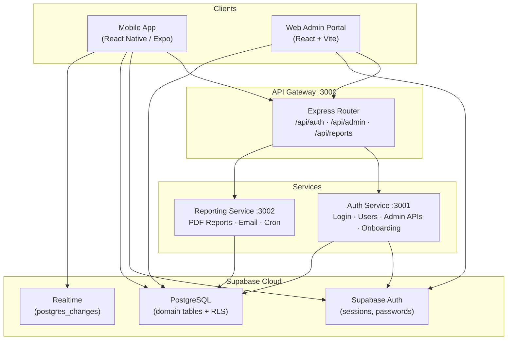
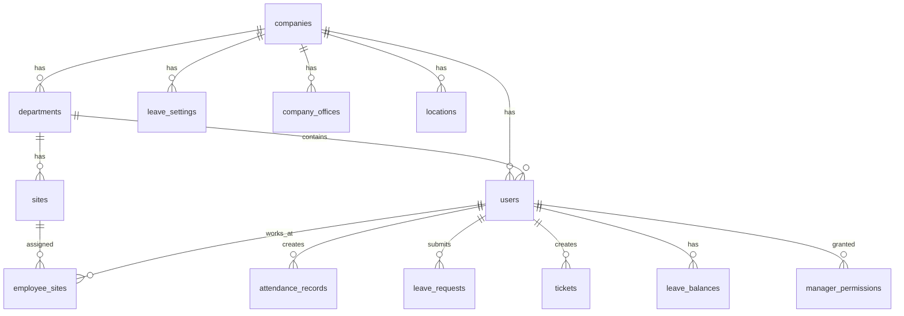
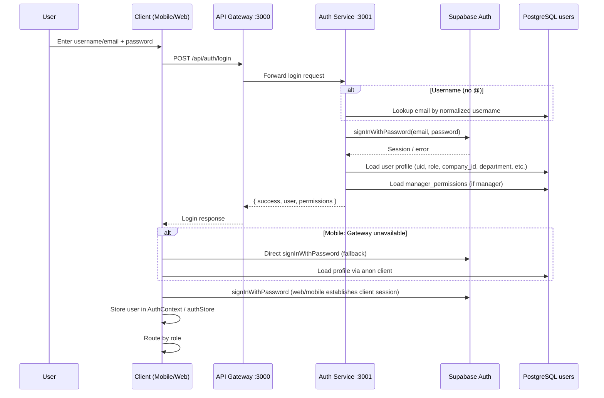
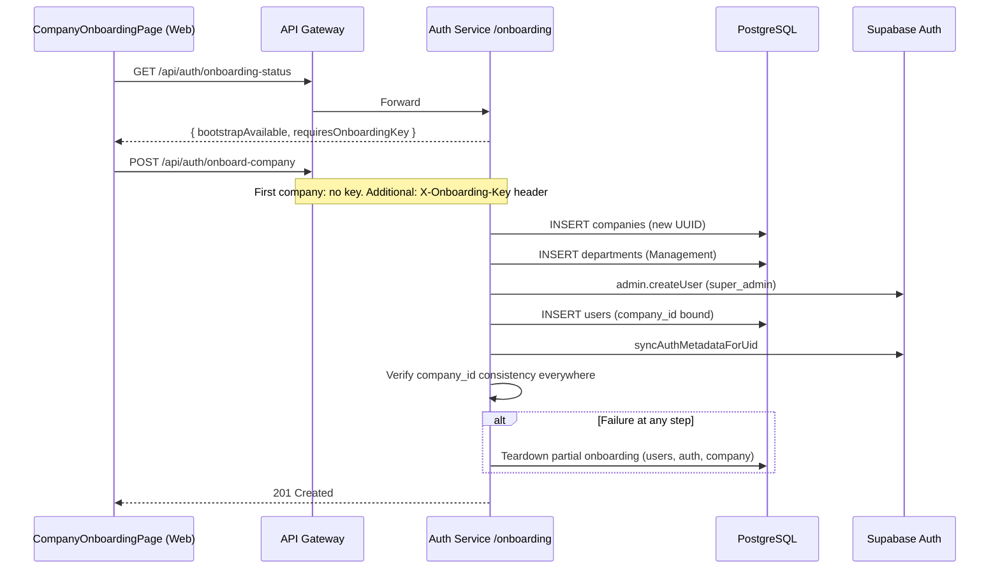
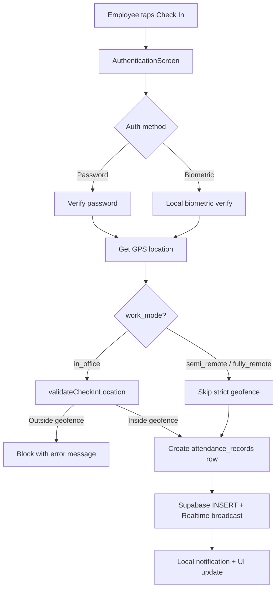
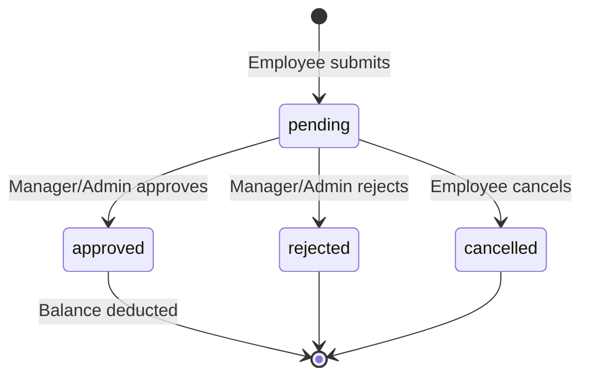
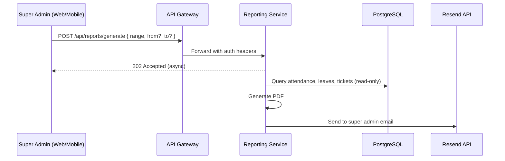

# Hadir.AI — Technical Product Workflow

**Document:** `hadir.ai_workflow.md`  
**Product:** Hadir.AI — Employee Attendance & Workforce Operations Platform  
**Last updated:** 2026-06-11  
**Scope:** End-to-end technical workflow of the existing product (mobile app, web admin portal, backend services, database, security, and deployment).

---

## Table of Contents

1. [Product Summary](#1-product-summary)
2. [High-Level Architecture](#2-high-level-architecture)
3. [Technology Stack](#3-technology-stack)
4. [Monorepo Structure](#4-monorepo-structure)
5. [Multi-Tenant Data Model](#5-multi-tenant-data-model)
6. [Authentication & Session Workflow](#6-authentication--session-workflow)
7. [Company Onboarding Workflow](#7-company-onboarding-workflow)
8. [Role Model & Permission System](#8-role-model--permission-system)
9. [Mobile App Workflow](#9-mobile-app-workflow)
10. [Web Admin Portal Workflow](#10-web-admin-portal-workflow)
11. [Backend Services Workflow](#11-backend-services-workflow)
12. [Database Schema & Entity Relationships](#12-database-schema--entity-relationships)
13. [Row-Level Security (RLS) Workflow](#13-row-level-security-rls-workflow)
14. [Attendance Workflow](#14-attendance-workflow)
15. [Geofencing & Location Workflow](#15-geofencing--location-workflow)
16. [Leave Management Workflow](#16-leave-management-workflow)
17. [Ticket Management Workflow](#17-ticket-management-workflow)
18. [Notifications Workflow](#18-notifications-workflow)
19. [Calendar & Events Workflow](#19-calendar--events-workflow)
20. [Employee & User Management Workflow](#20-employee--user-management-workflow)
21. [Department, Site & Assignment Workflow](#21-department-site--assignment-workflow)
22. [Reporting Service Workflow](#22-reporting-service-workflow)
23. [Realtime Subscriptions Workflow](#23-realtime-subscriptions-workflow)
24. [Data Storage Strategy](#24-data-storage-strategy)
25. [API Gateway Route Map](#25-api-gateway-route-map)
26. [Environment Configuration](#26-environment-configuration)
27. [Development & Local Run Workflow](#27-development--local-run-workflow)
28. [Build, CI/CD & Deployment Workflow](#28-build-cicd--deployment-workflow)
29. [Operational Runbook](#29-operational-runbook)
30. [Error Handling & Fallback Patterns](#30-error-handling--fallback-patterns)
31. [Appendix: Screen & Route Index](#31-appendix-screen--route-index)

---

## 1. Product Summary

Hadir.AI is a **multi-tenant workforce operations platform** that provides:

| Domain | Capabilities |
|--------|-------------|
| **Attendance** | GPS check-in/check-out, geofencing, manual entry, history, analytics |
| **Leave** | Annual/sick/casual leave, balances, approval workflow |
| **Tickets** | Category-based support tickets with automatic department routing |
| **Administration** | Users, departments, sites, geofences, manager permissions |
| **Reporting** | Scheduled and on-demand PDF reports via email |
| **Calendar** | Company events with visibility controls |

### Client Applications

| Client | Path | Primary users |
|--------|------|---------------|
| **Mobile App** | `apps/mobile` | Employees, managers, super admins (field operations) |
| **Web Admin Portal** | `apps/web` | Managers and super admins (governance & configuration) |
| **Backend Services** | `services/*` | API Gateway, Auth Service, Reporting Service |
| **Database** | `supabase/` | PostgreSQL + Supabase Auth + RLS |

### Design Principles

- **Supabase** is the source of truth for identity and persistent domain data.
- **API Gateway** is the single HTTP entry point for clients.
- **Auth Service** enforces tenant scope, role checks, and business rules server-side.
- **Managers** are department-scoped unless granted explicit tenant-wide permissions.
- **Employees** use the mobile app only; they do not access the web admin portal.

---

## 2. High-Level Architecture



### Request Flow (Typical Admin Action)

```
1. Web/Mobile client authenticates → Supabase session established
2. Client calls API Gateway with X-User-Context header (uid, role, company_id)
3. Gateway forwards to Auth Service
4. Auth Service validates requester identity + permissions + tenant scope
5. Auth Service reads/writes PostgreSQL via service-role Supabase client
6. Response returned through Gateway to client
7. Client may also read/write directly via Supabase anon client (RLS-enforced)
```

---

## 3. Technology Stack

### Frontend — Mobile (`apps/mobile`)

| Technology | Version (approx.) | Purpose |
|------------|-------------------|---------|
| React Native | 0.81.x | Mobile framework |
| Expo SDK | ~54 | Build, OTA updates, native modules |
| React Navigation | 6.x | Stack + Drawer navigation |
| NativeWind | 2.x | Tailwind-style styling |
| AsyncStorage | 2.x | Local persistence |
| expo-location | ~19 | GPS / geofencing |
| expo-local-authentication | ~17 | Biometrics |
| expo-updates | — | OTA update checks on cold start |
| @supabase/supabase-js | 2.x | Auth + DB + Realtime |

### Frontend — Web (`apps/web`)

| Technology | Purpose |
|------------|---------|
| React 18+ | UI |
| Vite | Dev server & build |
| React Router | Client-side routing |
| Zustand | Auth state (`authStore`) |
| Tailwind CSS | Styling (glass-morphism admin UI) |
| @supabase/supabase-js | Session + direct table reads |

### Backend Services

| Service | Port | Stack |
|---------|------|-------|
| `api-gateway` | 3000 | Express 5, Axios, CORS |
| `auth-service` | 3001 | Express 5, Supabase service-role client |
| `reporting-service` | 3002 | Express, PDF generation, Resend email API |

### Database & Infrastructure

| Component | Purpose |
|-----------|---------|
| Supabase Auth | Email/password, sessions, password reset |
| PostgreSQL | All domain tables |
| RLS policies | Client-side data isolation |
| Supabase CLI | Migrations via `npm run db:push` |
| GitHub Actions | Mobile build CI |
| EAS (Expo) | Production APK/IPA builds + OTA |
| Render / Vercel | Typical production hosting (backend / web) |

---

## 4. Monorepo Structure

```
Attendance_app_supabase/
├── apps/
│   ├── mobile/                 # React Native Expo app (primary employee UX)
│   │   ├── App.js              # Root: providers + OTA check
│   │   ├── core/               # Config, contexts, navigation, storage
│   │   ├── features/           # Partially migrated feature modules
│   │   ├── screens/            # Legacy screen components (still active)
│   │   ├── shared/             # Reusable components, constants, utils
│   │   └── utils/              # Legacy utilities (still active)
│   └── web/                    # React admin portal
│       └── src/
│           ├── core/           # Router, API client, Supabase, auth helpers
│           ├── features/       # auth/, admin/ pages & services
│           └── shared/         # AppShell, PermissionGate, UI components
├── services/
│   ├── api-gateway/            # HTTP entry point
│   ├── auth-service/           # Auth + admin + onboarding
│   └── reporting-service/      # Reports + scheduled jobs
├── supabase/
│   ├── migrations/             # Timestamped migrations (applied by CLI)
│   ├── legacy_migrations/      # Historical reference SQL
│   └── current.sql             # Schema snapshot for reference
├── scripts/                    # User creation, metadata sync
├── docs/                         # Additional architecture docs
├── hadir.ai_workflow.md          # This document
└── package.json                  # Root scripts (db:push, create-users, etc.)
```

### Code Organization Layers (Mobile)

| Layer | Path | Responsibility |
|-------|------|----------------|
| **Core** | `core/` | Supabase config, AuthContext, ThemeContext, CompanyContext, navigation |
| **Features** | `features/` | Auth, attendance, geofencing, company, analytics (partial migration) |
| **Screens** | `screens/` | UI screens (legacy location, still wired in navigation) |
| **Shared** | `shared/` | Roles, permissions, routes, Logo, Drawer components |
| **Utils** | `utils/` | Legacy business logic (notifications, leave, tickets, etc.) |

---

## 5. Multi-Tenant Data Model

Hadir.AI uses a **company-centric tenant model**. Every user belongs to exactly one `company_id`.



### Tenant Isolation Rules

1. Every `users` row has `company_id NOT NULL`.
2. Domain tables (`attendance_records`, `tickets`, `leave_requests`, `notifications`, `calendar_events`, `sites`) carry `company_id` for tenant filtering.
3. Usernames are **globally unique** after normalization (`normalized_username` column + unique index).
4. Login resolves username → email without tenant context (global username uniqueness required).
5. Post-login, all operations are scoped to the user's `company_id`.
6. RLS policies on `companies` ensure users only read/update their own company.
7. Auth Service uses `X-User-Context` header to enforce tenant scope on admin mutations.

### Company Onboarding Creates

1. New `companies` row
2. Default `Management` department
3. First `super_admin` user (Supabase Auth + `public.users`)
4. `leave_settings` defaults for the company
5. Auth `user_metadata` synced with `company_id`, `role`, `department`

---

## 6. Authentication & Session Workflow

### 6.1 Login Flow (Mobile & Web)



### 6.2 Login Identifier Normalization

- **Email login:** identifier contains `@` → used directly (normalized to lowercase).
- **Username login:** no `@` → Auth Service queries `users` by `normalized_username` variants → resolves email → Supabase Auth.
- Implemented in:
  - `services/auth-service/lib/loginNormalize.js`
  - `apps/web/src/core/auth/normalizeLogin.js`
  - `apps/mobile/features/auth/services/authService.js`

### 6.3 Session Persistence

| Client | Mechanism |
|--------|-----------|
| Mobile | Supabase client with custom AsyncStorage adapter (`core/config/supabase.js`) |
| Web | Supabase client default browser storage (`core/config/supabase.js`) |
| Both | `autoRefreshToken: true`, `persistSession: true` |

### 6.4 Post-Login Routing

| Role | Mobile destination | Web destination |
|------|-------------------|-----------------|
| `employee` | `EmployeeDashboard` (DrawerNavigator) | **Blocked** — employees do not use web admin |
| `manager` | `AdminDashboard` + permission-gated screens | `/` dashboard + scoped admin pages |
| `super_admin` | `AdminDashboard` (full access) | `/` dashboard + all admin pages |

### 6.5 Password Management

| Action | Flow | Implementation |
|--------|------|----------------|
| **Change password** | Current password verify → `updateUser({ password })` | `utils/passwordChange.js`, Theme Settings screen |
| **Forgot password** | `resetPasswordForEmail` → email link → deep link `hadirai://reset-password` | `ForgotPasswordScreen`, `ResetPasswordScreen`, `AppNavigator` linking |
| **Admin reset** | PATCH via gateway with `X-User-Context` | `/api/auth/users/uid/:uid/password` |

### 6.6 Biometric Authentication (Mobile)

1. User logs in with password + optional "Remember Me".
2. Credentials stored securely via `utils/credentialsStorage.js`.
3. Subsequent launches can use Face ID / Fingerprint via `expo-local-authentication`.
4. Biometric unlocks stored credentials → standard login flow.
5. Platform: Face ID (iOS), Fingerprint (Android).

### 6.7 Tenant Metadata Sync

After login, if JWT `user_metadata` is stale vs `public.users`:

1. Client calls `POST /api/auth/sync-metadata` via gateway.
2. Auth Service updates Supabase Auth `user_metadata` from DB (company_id, role, department).
3. Ensures RLS helper functions and client-side claims stay aligned.

Files: `apps/web/src/core/auth/syncTenantMetadata.js`, `services/auth-service/lib/authMetadata.js`

---

## 7. Company Onboarding Workflow

Used when bootstrapping the **first tenant** or adding additional companies (SaaS).



**Key files:** `services/auth-service/routes/onboarding.js`, `apps/web/src/features/auth/pages/CompanyOnboardingPage.jsx`

**Environment:** `COMPANY_ONBOARDING_SECRET` (min 16 chars) required for onboarding after the first company exists.

---

## 8. Role Model & Permission System

### 8.1 Base Roles

| Role | Scope | Web access |
|------|-------|------------|
| `employee` | Self-service only | No |
| `manager` | Department-scoped (default) | Yes, permission-gated |
| `super_admin` | Full tenant access | Yes, unrestricted |

### 8.2 Role vs Position vs Department

| Field | Purpose | Access control? |
|-------|---------|-----------------|
| `role` | `employee` / `manager` / `super_admin` | **Yes** |
| `position` | Job title (e.g. "AI Engineer") | No (descriptive) |
| `department` / `department_id` | Organizational unit | **Yes** (manager scope) |
| `work_mode` | `in_office` / `semi_remote` / `fully_remote` | Affects geofence rules |

### 8.3 Manager Granular Permissions

Stored in `manager_permissions` table (`manager_uid`, `permission_key`, `granted`).

**Permission groups** (from `apps/web/src/features/admin/permissions.js`):

| Group | Example permissions |
|-------|---------------------|
| User Management | `create_user`, `edit_user`, `delete_user`, `view_employees` |
| Attendance | `manual_attendance`, `view_attendance`, `export_attendance` |
| Leave | `view_leave_requests`, `approve_leave`, `reject_leave` |
| Tickets | `view_tickets`, `manage_tickets`, `assign_tickets` |
| Geofencing | `manage_geofencing`, `update_office_location` |
| Analytics | `view_analytics`, `export_reports`, `view_hr_dashboard` |
| Calendar | `create_events`, `edit_events`, `delete_events` |
| System | `manage_departments`, `approve_signup_requests`, `access_system_settings` |

**Default manager permissions** (when none explicitly set): view employees, edit user, manual/view attendance, leave approve/reject, ticket view/manage, HR dashboard, analytics, calendar CRUD.

**Super admins** bypass all permission checks (`hasPermission` always true).

**Web feature gating:** `canAccessFeature(user, featureKey)` maps routes to required permissions via `FEATURE_PERMISSIONS`.

**Backend enforcement:** `services/auth-service/lib/permissions.js` — `requirePermission`, `hasAnyPermission`, audit logging.

### 8.4 Audit Logs

`audit_logs` table records administrative mutations (manager permission changes, sensitive user updates). Accessible via `GET /api/admin/audit-logs` (super admin).

---

## 9. Mobile App Workflow

### 9.1 App Bootstrap (`App.js`)

```
1. Import react-native-gesture-handler (first)
2. Wrap with AuthProvider → ThemeProvider → CompanyProvider
3. Mount AppNavigator
4. On cold start (production only): checkForOTAUpdate() via expo-updates
5. clearLegacyDummyEmployeeCache() on mount
```

### 9.2 Navigation Architecture

```
AppNavigator
├── AuthNavigator (unauthenticated)
│   ├── LoginScreen
│   ├── SignUpScreen
│   ├── AuthMethodSelection
│   ├── ForgotPasswordScreen
│   └── ResetPasswordScreen
└── DrawerNavigator (authenticated)
    └── MainNavigator (role-based Stack)
        ├── Employee stack (role = employee)
        └── Admin/Manager stack (role = manager | super_admin)
```

**Deep linking:** scheme `hadirai://` — `reset-password`, `forgot-password` routes.

### 9.3 Employee Mobile Workflow

| Screen | Workflow |
|--------|----------|
| **EmployeeDashboard** | Today's status, check-in/out CTA, quick stats, notification badge |
| **AuthenticationScreen** | Password/biometric auth → geofence validation → save attendance record |
| **AttendanceHistory** | Personal records, filters, search |
| **LeaveRequestScreen** | Submit leave, view status, category routing |
| **TicketScreen** | Create ticket, track status |
| **CalendarScreen** | View/create events (Supabase `calendar_events`) |
| **NotificationsScreen** | Read/mark/clear notifications |
| **ThemeSettingsScreen** | Dark/light mode, password change |
| **HelpSupportScreen** | mailto support with fallback modal |
| **GeoFencingScreen** | View geofence info (employee read-only view) |

### 9.4 Manager / Super Admin Mobile Workflow

All employee screens plus (permission-gated):

| Screen | Workflow |
|--------|----------|
| **AdminDashboard** | Overview cards, navigation hub |
| **HRDashboard** | Leave approvals, work mode stats, department insights |
| **TicketManagementScreen** | Manage assigned tickets |
| **ManualAttendanceScreen** | Create attendance for employees |
| **EmployeeManagement** | View/edit department employees |
| **CreateUserScreen** | Create users (super_admin or permitted manager) |
| **DeleteUserScreen** | Deactivate/delete users |
| **ReportsScreen** | Trigger report generation |
| **AttendanceSettingsScreen** | Auto-checkout, attendance config |
| **GeoFencingScreen** | Manage department geofences |
| **CompanySettingsScreen** | Company name/logo (super_admin) |

### 9.5 Company Branding (`CompanyContext`)

On auth user change:
1. `getCompany(user.companyId)` from Supabase `companies` table.
2. Exposes `company`, `logoUrl`, `refreshCompany()` to UI (login logo, headers).

---

## 10. Web Admin Portal Workflow

### 10.1 Bootstrap

```
main.jsx → AppRouter
  → authStore.bootstrap()
    → supabase.auth.getSession()
    → load users row
    → sync tenant metadata if needed
    → load manager_permissions
```

### 10.2 Routes (`AppRouter.jsx`)

| Path | Page | Access |
|------|------|--------|
| `/login` | LoginPage | Public |
| `/onboard` | CompanyOnboardingPage | Public (bootstrap) |
| `/` | DashboardPage | Authenticated |
| `/users` | UsersPage | `users` feature permissions |
| `/departments` | DepartmentsPage | `manage_departments` |
| `/sites` | SitesPage | `manage_geofencing` |
| `/attendance` | AttendancePage | `view_attendance` / `manual_attendance` |
| `/leaves` | LeavesPage | leave permissions |
| `/tickets` | TicketsPage | ticket permissions |
| `/calendar` | CalendarPage | calendar permissions |
| `/analytics` | AnalyticsPage | `view_analytics` |
| `/reports` | ReportsPage | `export_reports` |
| `/settings` | SettingsPage | `access_system_settings` |
| `/manager-permissions` | ManagerPermissionsPage | super_admin only |
| `/notifications` | NotificationsPage | `manage_notifications` |

All protected routes wrapped in `<Protected>` + `<PermissionRoute>` with `<AppShell>` layout (sidebar navigation).

### 10.3 Web Login Specifics

1. `POST /api/auth/login` via API client (not direct Supabase first).
2. On success → `supabase.auth.signInWithPassword` to establish browser session.
3. Block employees: web login should reject or redirect non-admin roles.
4. Admin API calls include `X-User-Context` JSON header with caller identity.

### 10.4 Admin Service Layer

`apps/web/src/features/admin/services/adminService.js` — wraps gateway `/api/admin/*` endpoints for:
- Dashboard stats, analytics
- Users CRUD
- Departments overview, CRUD
- Sites, employee-site assignments
- Attendance list, leave list/approve
- Manager permissions, audit logs

---

## 11. Backend Services Workflow

### 11.1 API Gateway (`services/api-gateway`)

**Responsibilities:**
- CORS, JSON parsing, request logging (passwords redacted)
- Proxy `/api/auth/*` → Auth Service
- Proxy `/api/admin/*` → Auth Service admin routes
- Proxy `/api/reports/*` → Reporting Service
- 10-second timeout on forwarded requests
- Injects/forwards `X-User-Context` from client

**Health:** `GET /health` — returns status, build SHA, auth service URL.

### 11.2 Auth Service (`services/auth-service`)

**Route modules:**

| Module | Prefix | Purpose |
|--------|--------|---------|
| `routes/auth.js` | `/api/auth` | Login, users CRUD, sync-metadata, departments list |
| `routes/admin.js` | `/api/admin` | Dashboard, users, departments, sites, attendance, leaves, permissions, audit |
| `routes/onboarding.js` | `/api/auth` | Company onboarding |

**Security model:**
- Uses **service role key** (bypasses RLS for orchestrated operations).
- Every mutating admin route requires `X-User-Context` with valid `uid` + `role`.
- Resolves `company_id` from context or DB lookup.
- Manager routes apply department scope unless tenant-wide people permissions granted.
- Writes audit logs for sensitive operations.

**Lib modules:**
- `lib/loginNormalize.js` — username/email parsing
- `lib/departmentService.js` — department normalization per company
- `lib/permissions.js` — permission checks + audit
- `lib/authMetadata.js` — JWT metadata sync
- `lib/tenantScope.js` — company isolation helpers
- `lib/usernameUpdate.js` — scoped username changes

### 11.3 Reporting Service (`services/reporting-service`)

**Port:** 3002

**Capabilities:**
- `POST /api/reports/generate` — on-demand report (async, emailed)
- `GET /api/reports/download/:reportId` — download generated PDF
- `GET/PUT /api/reports/schedule` — cron schedule config
- `POST /api/reports/send-now` — trigger immediate send
- **Cron:** 1st of month 02:00 UTC — previous month report

**Report types:** weekly, monthly, yearly, all-time, custom date range.

**Output:** PDF with company-wide + department-wise statistics.

**Email:** Resend API (`RESEND_API_KEY`, `RESEND_FROM_EMAIL`).

**Auth:** Super admin only (`verifySuperAdmin` middleware via `x-user-id` / `x-user-email` headers).

---

## 12. Database Schema & Entity Relationships

### 12.1 Core Tables

| Table | Primary purpose | Key columns |
|-------|----------------|-------------|
| `companies` | Tenant root | `id`, `name`, `logo_url` |
| `users` | Employee profiles | `uid`, `username`, `email`, `role`, `company_id`, `department_id` |
| `departments` | Org units per company | `id`, `company_id`, `name`, `normalized_name` |
| `sites` | Geofenced locations per dept | `department_id`, `latitude`, `longitude`, `radius`, `company_id` |
| `employee_sites` | Employee ↔ site assignment | `employee_uid`, `site_id` |
| `company_offices` | Legacy company-wide office | `company_id`, lat/lng, `radius_meters` |
| `locations` | Named locations | `company_id`, lat/lng, `radius` |
| `attendance_records` | Check-in/out events | `user_uid`, `type`, `timestamp`, `location` (jsonb), `company_id` |
| `attendance_config` | Global attendance settings | `config_key`, `config_value` (jsonb) |
| `leave_requests` | Leave workflow | `employee_uid`, `leave_type`, dates, `status`, `company_id` |
| `leave_settings` | Per-company defaults | annual/sick/casual defaults, leave year |
| `leave_balances` | Per-user balances | `user_uid`, `company_id`, balances, `is_custom` |
| `tickets` | Support tickets | `category`, `priority`, `status`, `assigned_to`, `company_id` |
| `notifications` | In-app notifications | `recipient_uid`, `type`, `data` (jsonb), `company_id` |
| `calendar_events` | Events | `date`, `visibility`, `visible_to`, `company_id` |
| `signup_requests` | Self-registration queue | `username`, `status` (password cleared after processing) |
| `manager_permissions` | Granular manager ACL | `manager_uid`, `permission_key`, `granted` |
| `audit_logs` | Admin audit trail | actor, action, metadata |

### 12.2 Department Sync Trigger

`sync_user_department_fields` trigger on `users`:
- When `department` text is set → normalizes name → resolves/creates `departments` row → sets `department_id`.
- Requires `company_id` when department is non-null.
- Keeps legacy `department` text and canonical `department_id` FK aligned.

### 12.3 Username Normalization

`normalized_username` = `lower(trim(username))` with global unique index.
Trigger `set_users_normalized_username` maintains on insert/update.

---

## 13. Row-Level Security (RLS) Workflow

### Strategy

| Access path | Key used | RLS |
|-------------|----------|-----|
| Mobile/Web direct Supabase reads | Anon key + user JWT | **Enforced** |
| Auth Service / Reporting Service | Service role key | **Bypassed** |
| SECURITY DEFINER RPCs | Elevated function | Controlled elevation |

### Key RLS Migrations

| Migration | Purpose |
|-----------|---------|
| `20260512120000_users_rls_tenant_isolation.sql` | Tenant-scoped user reads |
| `20260514210000_companies_rls_tenant_scoped.sql` | Users read only own company |
| `20260515090000_users_rls_no_recursion.sql` | SECURITY DEFINER helpers avoid policy recursion |
| `20260517100000_signup_requests_rls_no_recursion.sql` | Safe signup request policies |
| `20260520110000_leave_settings_manager_rls.sql` | Manager leave settings access |

### RLS Pattern (Conceptual)

```sql
-- Users read own profile
USING (auth.uid()::text = uid)

-- Super admin reads all in tenant (via helper function, not self-referencing subquery)
USING (is_super_admin_in_company(company_id))

-- Manager reads department peers (via helper)
USING (is_manager_of_department(department_id))
```

**Important:** Recursive policies on `users` referencing `users` caused infinite loops — fixed via `SECURITY DEFINER` helper functions in migrations.

---

## 14. Attendance Workflow

### 14.1 Check-In Flow



### 14.2 Check-Out Flow

1. Same authentication as check-in.
2. `validateCheckoutLocation` (for `in_office` users):
   - If `auto_checkout_enabled` → allow checkout from anywhere.
   - Else → must be within department office radius.
3. Insert `type: 'checkout'` record.
4. **Automatic checkout:** `locationMonitoringService` polls GPS; if user leaves geofence while checked in → auto check-out + notification.

### 14.3 Manual Attendance (Managers / Super Admins)

1. Open `ManualAttendanceScreen`.
2. Select employee (scoped by role/permissions).
3. Set date, time, type, location.
4. Record saved with `is_manual: true`, `created_by` set to operator.

### 14.4 Attendance Record Schema (App ↔ DB)

| DB column | App field |
|-----------|-----------|
| `user_uid` | `userUid` |
| `employee_name` | `employeeName` |
| `type` | `checkin` / `checkout` |
| `timestamp` | ISO timestamp |
| `location` | `{ latitude, longitude, address, accuracy }` |
| `auth_method` | `password` / `face_id` / `fingerprint` |
| `is_manual` | boolean |
| `company_id` | tenant scope |

### 14.5 Attendance Config

`attendance_config` table stores JSON config (e.g. `auto_checkout_enabled`).
Read via `features/attendance/services/attendanceConfigService.js`.

---

## 15. Geofencing & Location Workflow

### 15.1 Geofence Sources (Priority)

1. **Department geofence** — via Supabase RPCs (`get_department_geofence`, `set_department_geofence`)
2. **Company office fallback** — `company_offices` table / `set_office_location` RPC
3. **Sites** — per-department `sites` table with `employee_sites` assignments
4. **Local cache** — AsyncStorage `@geofences`, `@active_geofence`

### 15.2 Permission to Manage Geofences

- Mobile: `manage_geofencing`, `update_office_location` permissions.
- Web: Sites page (`/sites`) for site CRUD.
- Backend RPCs validate caller role server-side.

### 15.3 Distance Calculation

`features/geofencing/utils/distance.js`:
- Haversine distance
- `isPointInGeofence`, `isWithin1km`, `formatDistance`

### 15.4 Location Monitoring Service

`features/geofencing/services/locationMonitoringService.js`:
- Runs for `in_office` users who are checked in.
- Compares current GPS to department office location.
- On exit → automatic checkout (when enabled).
- Sends local notification on permission issues.

---

## 16. Leave Management Workflow

### 16.1 Leave Types & Defaults

| Type | Default annual allocation |
|------|--------------------------|
| Annual | 20 days |
| Sick | 10 days |
| Casual | 5 days |

Configured per company in `leave_settings`; per-user overrides in `leave_balances` (`is_custom: true`).

### 16.2 Leave Request Lifecycle



### 16.3 Submission Flow (Mobile)

1. Employee opens `LeaveRequestScreen`.
2. Selects leave type, date range, full/half day, reason.
3. Selects **category** for routing (HR always enabled; own department enabled; others disabled).
4. INSERT into `leave_requests` (status: `pending`).
5. Notification sent to department manager + super admins.

### 16.4 Approval Flow

| Client | Flow |
|--------|------|
| Mobile HR Dashboard | Manager approves/rejects in Leaves section |
| Web `/leaves` | Same via `PATCH /api/admin/leaves/:id` |
| Auth Service | Validates department scope, updates status, `processed_by`, deducts balance |

### 16.5 Leave Display Enhancement

Migration `20260611120000_leave_requests_employee_display.sql` adds employee display fields for admin views.

---

## 17. Ticket Management Workflow

### 17.1 Ticket Creation (Employee)

1. Select category: HR, Finance, Engineering, Sales, Technical, Other.
2. Set priority: Low, Medium, High, Urgent.
3. Enter subject + description.
4. System routes ticket:

| Category | Routes to |
|----------|-----------|
| Engineering | Manager where `department = Engineering` |
| Technical | Manager where `department = Technical` |
| HR | HR department manager |
| Finance | Finance department manager |
| Sales | Sales department manager |
| Other | Super admin only (no auto-assign) |

5. Status: `open` → `in_progress` (on auto-assign) → `resolved` → `closed`.

### 17.2 Notifications on Ticket Events

- Super admins notified on all new tickets.
- Assigned manager notified on assignment.
- Employee notified on status changes / responses.

### 17.3 Ticket Storage

Primary: Supabase `tickets` table (with `company_id`).
Legacy/local: AsyncStorage `@tickets` may still be used in some mobile paths during migration — cloud is canonical.

---

## 18. Notifications Workflow

### 18.1 Storage

- **Supabase:** `notifications` table (tenant-scoped, `recipient_uid`).
- **AsyncStorage:** `@notifications` (local cache / offline).

### 18.2 Notification Object

```json
{
  "id": "uuid",
  "recipientUsername": "testuser",
  "title": "Leave Approved",
  "body": "Your annual leave was approved",
  "type": "leave_approved",
  "data": { "screen": "LeaveRequest", "leaveId": "..." },
  "read": false,
  "isRead": false,
  "readAt": null,
  "createdAt": "ISO-8601"
}
```

### 18.3 Operations (`utils/notifications.js`)

| Function | Behavior |
|----------|----------|
| `markNotificationAsRead(id)` | Set read + verify persistence |
| `markAllNotificationsAsRead(username)` | Bulk mark |
| `clearReadNotifications(username)` | Remove read only |
| `getUnreadNotificationCount(username)` | Badge count |

### 18.4 Navigation on Tap (`utils/notificationNavigation.js`)

Role-aware routing:
- Leave events → HR Dashboard (manager) or LeaveRequestScreen (employee)
- Ticket events → TicketManagement / TicketScreen
- Marks read after successful navigation

---

## 19. Calendar & Events Workflow

### 19.1 Data Store

Primary: `calendar_events` in Supabase (tenant-scoped).

### 19.2 Visibility Model

| Value | Meaning |
|-------|---------|
| `all` | Visible to all active company users |
| `none` | Creator only |
| `selected` | `visible_to` JSON array of usernames/UIDs |

### 19.3 Mobile Calendar Screen

1. Load events from Supabase on mount and on screen focus.
2. Create event → INSERT with `created_by_uid`, `company_id`.
3. RLS enforces visibility rules.
4. AsyncStorage fallback only if Supabase unavailable.

---

## 20. Employee & User Management Workflow

### 20.1 User Creation

**Who:** Super admin, or manager with `create_user` permission.

```
1. Fill form (username, email, password, name, role, department, position, work_mode)
2. POST /api/auth/users with X-User-Context
3. Auth Service:
   a. Validate permissions + tenant scope
   b. supabase.auth.admin.createUser
   c. INSERT public.users (company_id, department_id via trigger)
   d. Create leave_balances row
   e. syncAuthMetadataForUid
   f. writeAuditLog
4. User can immediately login
```

**Scripts (bootstrap/dev):**
- `scripts/create-users-supabase.js`
- `scripts/create-new-users-automated.js`

### 20.2 Signup Request Flow

1. Employee submits signup via `SignUpScreen`.
2. Row inserted in `signup_requests` (status: `pending`).
3. Manager/super_admin with `approve_signup_requests` reviews.
4. On approval → user created via same pipeline as manual creation.
5. Password field cleared on signup_requests row after processing.

### 20.3 User Updates / Deactivation

- `PATCH /api/auth/users/:username` or `/api/admin/users/:uid`
- Managers scoped to department (unless tenant-wide people access).
- `DELETE /api/auth/users/:uid` — soft deactivate or hard delete per implementation.
- Self-administrative changes blocked (`rejectSelfAdministrativeChange`).

---

## 21. Department, Site & Assignment Workflow

### 21.1 Department CRUD (Web / API)

| Action | Endpoint | Rules |
|--------|----------|-------|
| List | `GET /api/admin/departments` | Scoped by role |
| Overview | `GET /api/admin/departments/overview` | Counts, manager, expandable employees |
| Create | `POST /api/admin/departments` | Super admin; normalized name uniqueness per company |
| Rename | `PATCH /api/admin/departments/:id` | Cascades to `users.department` text |
| Delete | `DELETE /api/admin/departments/:id` | Blocked if active users exist |

### 21.2 Site Management

```
POST /api/admin/sites
  { name, latitude, longitude, radius, department_id }

Rules:
- Manager: department_id must match manager's department
- Super admin: any department in tenant
- site.company_id derived from department.company_id
```

### 21.3 Employee-Site Assignment

```
POST /api/admin/employee-sites
  { employee_uid, site_id }

Validation:
- employee.department_id must equal site.department_id
- Cross-department assignment → 403 rejected
```

---

## 22. Reporting Service Workflow



**Scheduled job:** 1st of each month, 02:00 UTC — generates previous month's report.

---

## 23. Realtime Subscriptions Workflow

### Attendance Realtime (`features/attendance/services/realtimeAttendance.js`)

```
Channel: attendance-realtime-insert / update
Table: attendance_records
Filter:
  - employee → user_uid=eq.{uid}
  - manager → RLS filters department (client listens broadly)
  - super_admin → all records
Event: INSERT, UPDATE → convert DB row → callback → UI refresh
```

### Other Realtime (where enabled)

- `features/employees/services/realtimeEmployees.js` — employee list changes
- Supabase `postgres_changes` pattern used across features

---

## 24. Data Storage Strategy

### 24.1 Supabase (Cloud — Source of Truth)

| Data | Table(s) |
|------|----------|
| User profiles | `users` |
| Auth credentials | Supabase Auth (not in public schema) |
| Attendance | `attendance_records` |
| Leave | `leave_requests`, `leave_balances`, `leave_settings` |
| Tickets | `tickets` |
| Notifications | `notifications` |
| Calendar | `calendar_events` |
| Org structure | `companies`, `departments`, `sites`, `employee_sites` |
| Permissions | `manager_permissions` |
| Audit | `audit_logs` |
| Signup queue | `signup_requests` |

### 24.2 AsyncStorage (Mobile Local)

| Key | Purpose |
|-----|---------|
| `@company_employees` | Employee list cache |
| `@attendance_records` | Legacy/local attendance cache |
| `@tickets` | Legacy ticket cache |
| `@notifications` | Notification cache |
| `@leave_requests` | Legacy leave cache |
| `@signup_requests` | Signup cache |
| `@geofences` | Geofence cache |
| `@active_geofence` | Active geofence selection |
| `@auth_preferences` | Biometric / remember-me |
| `@theme_preference` | Dark/light mode |
| Supabase session keys | Via custom adapter |

### 24.3 Sync Direction

```
Supabase (canonical) → AsyncStorage (cache/offline)
Writes: prefer Supabase first; update local cache on success
```

---

## 25. API Gateway Route Map

### `/api/auth/*` → Auth Service

| Method | Path | Description |
|--------|------|-------------|
| POST | `/login` | Authenticate user |
| GET | `/onboarding-status` | Bootstrap availability |
| POST | `/onboard-company` | Create tenant |
| POST | `/sync-metadata` | Sync JWT metadata |
| GET | `/check-username/:username` | Username availability |
| POST | `/users` | Create user |
| DELETE | `/users/:uid` | Delete/deactivate user |
| PATCH | `/users/:username` | Update user profile |
| PATCH | `/users/:username/role` | Update role |
| PATCH | `/users/uid/:uid/*` | UID-based updates (email, password, username, role) |
| GET | `/departments` | List departments (auth context) |
| GET | `/position-suggestions` | Position autocomplete |

### `/api/admin/*` → Auth Service Admin

| Method | Path | Description |
|--------|------|-------------|
| GET | `/dashboard/stats` | Dashboard KPIs |
| GET | `/analytics` | Analytics aggregates |
| GET/POST/PATCH/DELETE | `/departments/*` | Department CRUD + overview |
| GET/POST | `/sites`, `/employee-sites` | Site management |
| GET | `/users`, `/users/:uid` | User listing |
| PATCH | `/users/:uid` | Admin user update |
| GET | `/attendance` | Attendance records |
| GET/PATCH | `/leaves`, `/leaves/:id` | Leave management |
| GET/PUT | `/managers/:uid/permissions` | Manager ACL |
| GET | `/audit-logs` | Audit trail |
| GET | `/permissions/meta` | Permission definitions |

### `/api/reports/*` → Reporting Service

| Method | Path | Description |
|--------|------|-------------|
| POST | `/generate` | Generate report |
| GET | `/download/:reportId` | Download PDF |
| GET/PUT | `/schedule` | Report schedule |
| POST | `/send-now` | Immediate send |
| GET | `/health` | Service health |

---

## 26. Environment Configuration

### Mobile (`apps/mobile/.env`)

```env
EXPO_PUBLIC_SUPABASE_URL=https://<project>.supabase.co
EXPO_PUBLIC_SUPABASE_ANON_KEY=<anon-key>
```

### Mobile (`apps/mobile/app.json` → `expo.extra`)

```json
{
  "scheme": "hadirai",
  "extra": {
    "apiGatewayUrl": "http://<LAN-IP>:3000",
    "supabaseRedirectUrl": "hadirai://reset-password"
  }
}
```

### Web (`apps/web/.env`)

```env
VITE_API_GATEWAY_URL=https://<gateway-host>
VITE_SUPABASE_URL=https://<project>.supabase.co
VITE_SUPABASE_ANON_KEY=<anon-key>
```

### Auth Service (`services/auth-service/.env`)

```env
PORT=3001
HOST=0.0.0.0
SUPABASE_URL=https://<project>.supabase.co
SUPABASE_SERVICE_ROLE_KEY=<service-role-key>
COMPANY_ONBOARDING_SECRET=<min-16-chars>  # required after first company
```

### API Gateway (`services/api-gateway/.env`)

```env
PORT=3000
HOST=0.0.0.0
AUTH_SERVICE_URL=http://localhost:3001
REPORTING_SERVICE_URL=http://localhost:3002
```

### Reporting Service (`services/reporting-service/.env`)

```env
PORT=3002
SUPABASE_URL=https://<project>.supabase.co
SUPABASE_SERVICE_ROLE_KEY=<service-role-key>
RESEND_API_KEY=re_xxxxx
RESEND_FROM_EMAIL=noreply@yourdomain.com
REPORT_RECIPIENT_EMAIL=admin@yourdomain.com
```

### EAS Production Builds

Environment variables set as EAS secrets (not `.env` files):
```bash
eas env:create --name EXPO_PUBLIC_SUPABASE_URL --value "..." --scope project
eas env:create --name EXPO_PUBLIC_SUPABASE_ANON_KEY --value "..." --scope project
```

---

## 27. Development & Local Run Workflow

### 27.1 Prerequisites

- Node.js 18+
- npm
- Expo CLI
- Supabase project (Auth + DB enabled)
- Supabase CLI (`npm run db:push` for migrations)

### 27.2 Install

```bash
# Root
npm install

# Services
cd services/api-gateway && npm install
cd services/auth-service && npm install
cd services/reporting-service && npm install

# Mobile
cd apps/mobile && npm install

# Web
cd apps/web && npm install
```

### 27.3 Database Setup

```bash
npm run db:push          # Apply supabase/migrations/
npm run create-users     # Or automated script for demo users
```

### 27.4 Start Services

**Windows:** `.\start-services.ps1`  
**Linux/macOS:** `./start-services.sh`

Or manually:
```bash
# Terminal 1
cd services/api-gateway && npm start

# Terminal 2
cd services/auth-service && npm start

# Terminal 3 (optional)
cd services/reporting-service && npm start

# Terminal 4 — Mobile
cd apps/mobile && npm start

# Terminal 5 — Web
cd apps/web && npm run dev
```

### 27.5 Platform-Specific API Gateway URLs

| Environment | URL |
|-------------|-----|
| iOS Simulator | `http://localhost:3000` |
| Android Emulator | `http://10.0.2.2:3000` |
| Physical device | `http://<your-LAN-IP>:3000` |

---

## 28. Build, CI/CD & Deployment Workflow

### 28.1 Mobile — EAS Build

```bash
cd apps/mobile
eas build -p android --profile preview    # APK for testing
eas build -p android --profile production
eas build -p ios --profile production
```

Profiles defined in `apps/mobile/eas.json`: `development`, `preview`, `production`.

### 28.2 Mobile — OTA Updates

- `app.json`: `checkAutomatically: "ON_LOAD"`
- `App.js`: prompts user to restart when update downloaded
- Workflow: `.github/workflows/eas-update.yml`

### 28.3 GitHub Actions CI (`.github/workflows/deploy.yml`)

Triggered on push/PR to `main`/`master`:
1. Checkout
2. Setup Node 18
3. Validate `package-lock.json`
4. `npm ci` (with fallback to `npm install`)
5. Lint + format check (non-blocking)
6. Android + iOS build scripts (graceful skip on failure)

### 28.4 Production Deployment Pattern

1. Merge to main branch
2. `npm run db:push` (apply migrations to linked Supabase project)
3. Deploy Auth Service → API Gateway → Reporting Service (e.g. Render)
4. Deploy Web to Vercel (`apps/web` root)
5. EAS build + submit mobile app
6. Smoke test: login, departments, scoped leaves/attendance, site assignment

---

## 29. Operational Runbook

### 29.1 Migration Workflow

```bash
npm run db:status     # List applied migrations
npm run db:push       # Apply pending migrations
npm run db:diff       # Generate diff from local changes
npm run db:new <name> # Create new migration file
```

### 29.2 Auth Metadata Sync (Bulk)

```bash
npm run sync-auth-metadata
# Runs scripts/sync-all-auth-metadata.js
```

### 29.3 Service Restart Order

1. `auth-service`
2. `api-gateway`
3. `reporting-service` (if used)
4. Web dev server hard-refresh / mobile app reload

### 29.4 Health Checks

| Service | Endpoint |
|---------|----------|
| API Gateway | `GET http://localhost:3000/health` |
| Auth Service | `GET http://localhost:3001/health` |
| Reporting Service | `GET http://localhost:3002/health` |

### 29.5 Demo Credentials (after user creation script)

| Role | Username | Password |
|------|----------|----------|
| Super Admin | `testadmin` | `testadmin123` |
| Manager | `techmanager` | `techmanager123` |
| Employee | `testuser` | `testuser123` |

---

## 30. Error Handling & Fallback Patterns

| Scenario | Behavior |
|----------|----------|
| API Gateway down (mobile login) | Fallback to direct Supabase `signInWithPassword` |
| Geofence RPC missing | Fall back to legacy `company_offices` / AsyncStorage |
| Location permission denied | Block check-in (in_office) with user message |
| Checkout validation error | Graceful allow with warning (configurable) |
| RLS permission denied | User-friendly error; check policies / metadata sync |
| Service role misconfigured | Onboarding returns 503 with `SERVICE_ROLE_KEY_MISCONFIGURED` |
| OTA update failure | Swallowed — app must always launch |
| Report email failure | Logged; retry via `send-now` endpoint |
| npm ci lockfile corruption | CI auto-regenerates lockfile |

---

## 31. Appendix: Screen & Route Index

### 31.1 Mobile Screens (`apps/mobile/screens/`)

| Screen | Route constant | Roles |
|--------|---------------|-------|
| LoginScreen | `ROUTES.LOGIN` | Public |
| SignUpScreen | `ROUTES.SIGN_UP` | Public |
| ForgotPasswordScreen | `ROUTES.FORGOT_PASSWORD` | Public |
| ResetPasswordScreen | `ROUTES.RESET_PASSWORD` | Public |
| EmployeeDashboard | `ROUTES.EMPLOYEE_DASHBOARD` | employee |
| AdminDashboard | `ROUTES.ADMIN_DASHBOARD` | manager, super_admin |
| HRDashboard | `ROUTES.HR_DASHBOARD` | manager, super_admin |
| AuthenticationScreen | `ROUTES.AUTHENTICATION_SCREEN` | all |
| AttendanceHistory | `ROUTES.ATTENDANCE_HISTORY` | all |
| LeaveRequestScreen | `ROUTES.LEAVE_REQUEST` | all |
| TicketScreen | `ROUTES.TICKET_SCREEN` | all |
| TicketManagementScreen | `ROUTES.TICKET_MANAGEMENT` | manager, super_admin |
| ManualAttendanceScreen | `ROUTES.MANUAL_ATTENDANCE` | permitted managers |
| CalendarScreen | `ROUTES.CALENDAR` | all |
| NotificationsScreen | `ROUTES.NOTIFICATIONS` | all |
| ThemeSettingsScreen | `ROUTES.THEME_SETTINGS` | all |
| HelpSupportScreen | `ROUTES.HELP_SUPPORT` | all |
| CreateUserScreen | `ROUTES.CREATE_USER` | super_admin / permitted |
| DeleteUserScreen | `ROUTES.DELETE_USER` | super_admin / permitted |
| EmployeeManagement | `ROUTES.EMPLOYEE_MANAGEMENT` | manager, super_admin |
| ReportsScreen | `ROUTES.REPORTS` | super_admin |
| AttendanceSettingsScreen | `ROUTES.ATTENDANCE_SETTINGS` | manager, super_admin |
| AuthMethodSelection | `ROUTES.AUTH_METHOD_SELECTION` | all |

### 31.2 Web Routes (`apps/web`)

See [Section 10.2](#102-routes-approuterjsx).

### 31.3 Related Documentation

| Document | Path |
|----------|------|
| Setup guide | `SETUP.md` |
| System architecture | `docs/SYSTEM_ARCHITECTURE.md` |
| Technical documentation | `docs/TECHNICAL_DOCUMENTATION.md` |
| App features | `docs/APP_FEATURES.md` |
| Modular architecture | `docs/MODULAR_ARCHITECTURE.md` |
| Product & use cases | `docs/PRODUCT_DOCUMENTATION_AND_USE_CASES.md` |
| User creation scripts | `scripts/README_AUTOMATED_USER_CREATION.md` |
| EAS build setup | `apps/mobile/EAS_BUILD_SETUP.md` |
| OTA updates | `apps/mobile/OTA_UPDATES.md` |

---

**End of document.**
