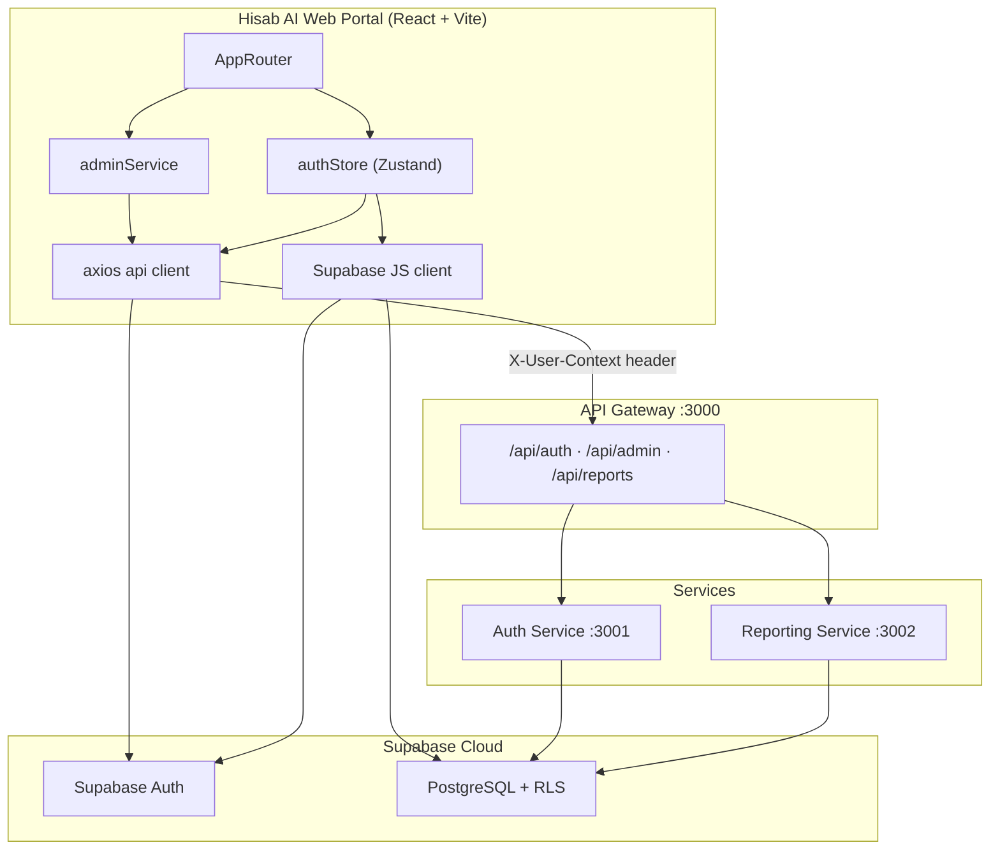
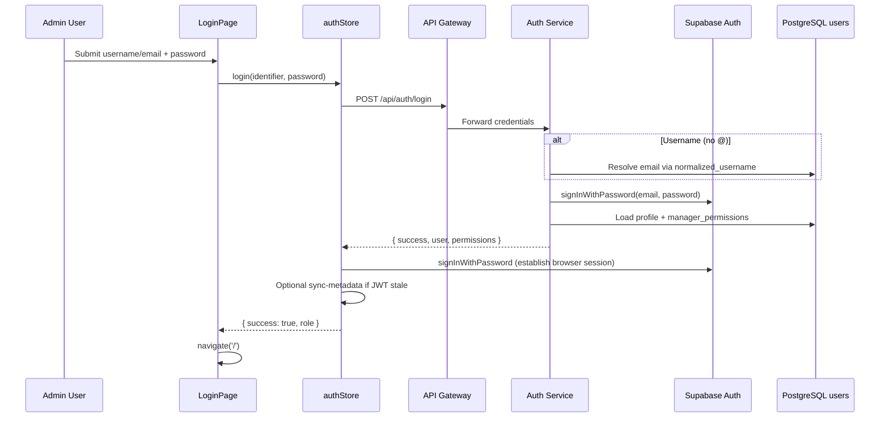
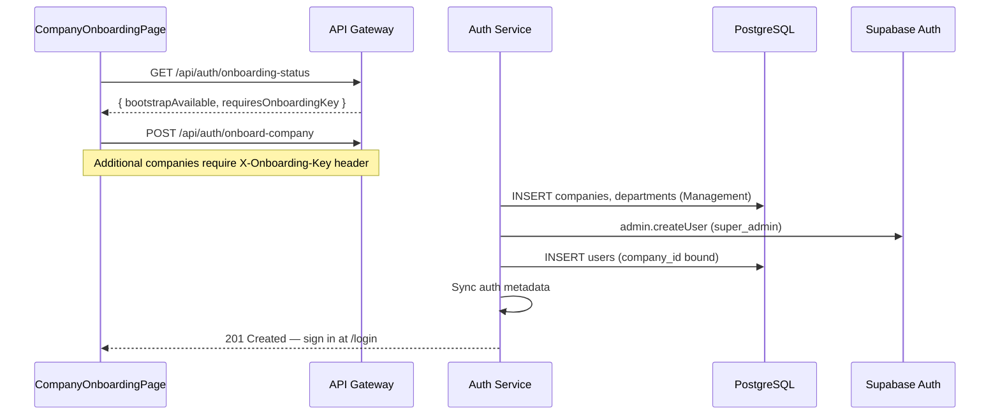
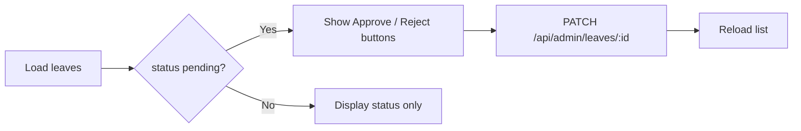

# Hisab AI — Web Portal Technical Workflow

**Document:** `hisab ai web portal workflow.md`  
**Product:** Hisab AI Web Portal — Administrative & Governance Console  
**Codebase path:** `apps/web`  
**Last updated:** 2026-06-18  
**Scope:** End-to-end technical workflow of the web admin portal only (frontend, auth, routing, permissions, API integration, deployment). Mobile app and field-employee flows are out of scope.

---

## Table of Contents

1. [Product Summary](#1-product-summary)
2. [High-Level Architecture](#2-high-level-architecture)
3. [Technology Stack](#3-technology-stack)
4. [Project Structure](#4-project-structure)
5. [Application Bootstrap & Routing](#5-application-bootstrap--routing)
6. [Authentication & Session Workflow](#6-authentication--session-workflow)
7. [Company Onboarding Workflow](#7-company-onboarding-workflow)
8. [Role Model & Permission System](#8-role-model--permission-system)
9. [Layout & Navigation (AppShell)](#9-layout--navigation-appshell)
10. [Feature Page Workflows](#10-feature-page-workflows)
11. [Admin Service Layer & API Client](#11-admin-service-layer--api-client)
12. [Backend Routes Consumed by the Portal](#12-backend-routes-consumed-by-the-portal)
13. [Supabase Direct Access](#13-supabase-direct-access)
14. [Shared UI Components](#14-shared-ui-components)
15. [Environment Configuration](#15-environment-configuration)
16. [Development Workflow](#16-development-workflow)
17. [Build & Deployment](#17-build--deployment)
18. [Error Handling & Fallback Patterns](#18-error-handling--fallback-patterns)
19. [Appendix: Route & File Index](#19-appendix-route--file-index)

---

## 1. Product Summary

Hisab AI Web Portal is the **browser-based administrative console** for workforce operations governance. It is used exclusively by **managers** and **super admins** — employees do not access this portal.

| Domain | Portal capabilities |
|--------|---------------------|
| **Dashboard** | KPIs, recent activity, quick navigation, CSV export |
| **Users** | List, create, edit, role changes, activation |
| **Departments** | CRUD, employee counts, department overview |
| **Attendance** | View records, refresh polling, export (permission-gated) |
| **Leaves** | View requests, approve/reject pending leaves |
| **Tickets** | Department support ticket administration |
| **Geofencing (Sites)** | Site CRUD, employee-site assignment |
| **Calendar** | Company event management |
| **Analytics** | Department distribution, attendance insights |
| **Reports** | On-demand PDF generation, scheduled email reports |
| **Notifications** | Broadcast and manage in-app notifications |
| **Settings** | System overview, role counts, department summary |
| **Manager Permissions** | Super-admin ACL editor for managers |

### Design Principles

- **Supabase Auth** holds the browser session; **PostgreSQL** (`public.users`, `manager_permissions`) holds profile and ACL data.
- **API Gateway** is the single HTTP entry point for admin mutations and aggregated reads.
- **Auth Service** enforces tenant scope, role checks, and department scoping server-side.
- **Managers** are department-scoped by default unless granted tenant-wide permissions.
- **Super admins** bypass all permission checks in the UI and on protected admin routes.
- UI uses a **glass-morphism** admin theme (Tailwind CSS, blue gradient shell).

### Relationship to the Broader Platform

The web portal shares backend services and database with the mobile employee app:

```
Hisab AI Web Portal (apps/web)
    ├── API Gateway :3000  → Auth Service :3001, Reporting Service :3002
    ├── Supabase Auth      → Browser session (JWT)
    └── Supabase PostgreSQL → Direct reads (RLS-enforced) for bootstrap & permissions
```

For the full platform architecture (mobile, geofencing, realtime, etc.), see `hadir.ai_workflow.md`.

---

## 2. High-Level Architecture



### Typical Admin Action Flow

```
1. User is authenticated → Supabase session in browser storage
2. Page calls adminService method
3. axios interceptor attaches X-User-Context JSON (uid, role, company_id, permissions)
4. Request hits API Gateway → forwarded to Auth Service or Reporting Service
5. Backend validates identity, permissions, and tenant/department scope
6. Backend reads/writes PostgreSQL via service-role client
7. JSON response returned to page → UI updates
```

---

## 3. Technology Stack

| Technology | Version (approx.) | Purpose |
|------------|-------------------|---------|
| React | 18.3.x | UI framework |
| Vite | 5.4.x | Dev server, HMR, production build |
| React Router | 6.30.x | Client-side routing |
| Zustand | 4.5.x | Auth state (`authStore`) |
| Axios | 1.13.x | HTTP client to API Gateway |
| Tailwind CSS | 3.4.x | Utility-first styling |
| @supabase/supabase-js | 2.49.x | Auth session, direct table reads |

**Package name:** `hadir-admin-web` (internal npm name in `apps/web/package.json`).

---

## 4. Project Structure

```
apps/web/
├── index.html                    # Vite entry HTML
├── vite.config.js                # Vite + React plugin
├── tailwind.config.js            # Tailwind theme extensions
├── postcss.config.js
├── vercel.json                   # SPA rewrites for client routing
├── .env.example                  # Required env vars template
├── public/
│   └── logo.jpeg                 # Portal logo
└── src/
    ├── main.jsx                  # ReactDOM.createRoot → AppRouter
    ├── core/
    │   ├── router/
    │   │   └── AppRouter.jsx     # Route definitions, guards
    │   ├── api/
    │   │   └── client.js         # Axios instance + interceptors
    │   ├── config/
    │   │   ├── api.js            # API Gateway URL resolution
    │   │   ├── supabase.js       # Supabase client init
    │   │   └── env.js            # Env helpers
    │   └── auth/
    │       ├── normalizeLogin.js # Username/email parsing
    │       ├── tenantClaims.js   # JWT vs DB metadata comparison
    │       └── syncTenantMetadata.js
    ├── features/
    │   ├── auth/
    │   │   ├── store/
    │   │   │   └── authStore.js  # login, logout, bootstrap
    │   │   └── pages/
    │   │       ├── LoginPage.jsx
    │   │       └── CompanyOnboardingPage.jsx
    │   └── admin/
    │       ├── permissions.js    # Permission constants + gating helpers
    │       ├── services/
    │       │   └── adminService.js
    │       ├── utils/
    │       │   └── leaveDisplay.js
    │       └── pages/            # One page per admin feature
    └── shared/
        ├── components/
        │   ├── AppShell.jsx      # Sidebar + header layout
        │   ├── PermissionGate.jsx
        │   ├── GlassCard.jsx
        │   ├── GlassTable.jsx
        │   ├── SlideOverPanel.jsx
        │   └── PasswordInput.jsx
        └── styles/
            └── index.css         # Tailwind directives + animations
```

### Layer Responsibilities

| Layer | Path | Responsibility |
|-------|------|----------------|
| **Core** | `src/core/` | Router, HTTP client, Supabase config, auth utilities |
| **Features** | `src/features/` | Auth pages/store, admin pages, admin service, permissions |
| **Shared** | `src/shared/` | Reusable layout and UI primitives |

---

## 5. Application Bootstrap & Routing

### 5.1 Bootstrap Sequence

```
main.jsx
  └── <AppRouter />
        └── useEffect → authStore.bootstrap()
              ├── supabase.auth.getSession()
              ├── if session: load public.users row by uid
              ├── if JWT metadata stale: POST /api/auth/sync-metadata
              ├── load manager_permissions (if manager)
              └── set user in Zustand store
```

**Key file:** `src/features/auth/store/authStore.js`

### 5.2 Route Map (`AppRouter.jsx`)

| Path | Page component | Guard |
|------|----------------|-------|
| `/login` | `LoginPage` | Public |
| `/onboard` | `CompanyOnboardingPage` | Public |
| `/unauthorized` | `AccessDenied` | Public |
| `/` | `DashboardPage` | `Protected` + `AppShell` |
| `/users` | `UsersPage` | `PermissionRoute feature="users"` |
| `/departments` | `DepartmentsPage` | `PermissionRoute feature="departments"` |
| `/sites` | `SitesPage` | `PermissionRoute feature="sites"` |
| `/attendance` | `AttendancePage` | `PermissionRoute feature="attendance"` |
| `/leaves` | `LeavesPage` | `PermissionRoute feature="leaves"` |
| `/tickets` | `TicketsPage` | `PermissionRoute feature="tickets"` |
| `/calendar` | `CalendarPage` | `PermissionRoute feature="calendar"` |
| `/analytics` | `AnalyticsPage` | `PermissionRoute feature="analytics"` |
| `/reports` | `ReportsPage` | `PermissionRoute feature="reports"` |
| `/notifications` | `NotificationsPage` | `PermissionRoute feature="notifications"` |
| `/settings` | `SettingsPage` | `PermissionRoute feature="settings"` |
| `/manager-permissions` | `ManagerPermissionsPage` | `superAdminOnly` + `feature="permissions"` |

### 5.3 Route Guards

| Guard | Behavior |
|-------|----------|
| `Protected` | Redirects to `/login` if no authenticated user; shows loading spinner during bootstrap |
| `PermissionRoute` | Renders `AccessDenied` if `canAccessFeature(user, feature)` fails |
| `superAdminOnly` | Additional check: `user.role === 'super_admin'` |

Dashboard (`/`) is accessible to any authenticated manager or super admin without feature-specific permissions.

---

## 6. Authentication & Session Workflow

### 6.1 Login Flow



### 6.2 Login Identifier Normalization

- **Email:** identifier contains `@` → lowercased and used directly.
- **Username:** no `@` → Auth Service resolves `normalized_username` variants → email → Supabase Auth.
- Client-side mirror: `src/core/auth/normalizeLogin.js` (`parseLoginIdentifier`, `usernameEqVariants`).

### 6.3 Gateway Fallback Login

If the API Gateway is unavailable (network error, misconfigured URL, local URL in production), `authStore.login` falls back to:

1. Resolve email (direct or via Supabase `users` lookup).
2. `supabase.auth.signInWithPassword`.
3. Load `public.users` profile.
4. Fetch `manager_permissions` from Supabase directly.

This ensures local development can proceed when only Supabase is reachable.

### 6.4 Session Persistence

| Setting | Value |
|---------|-------|
| Storage | Browser default (localStorage via Supabase JS) |
| `persistSession` | `true` |
| `autoRefreshToken` | `true` |

**Config file:** `src/core/config/supabase.js`

### 6.5 Post-Login Access Rules

| Role | Web portal access |
|------|-------------------|
| `employee` | **Blocked** — employees use the mobile app only |
| `manager` | Yes — sidebar and routes filtered by `manager_permissions` |
| `super_admin` | Yes — full access to all routes and actions |

### 6.6 Logout

```
authStore.logout()
  ├── supabase.auth.signOut()
  └── set user: null
```

Sidebar and profile menu both call `logout`.

### 6.7 Tenant Metadata Sync

When JWT `user_metadata` is stale compared to `public.users` (company_id, role, department):

1. `shouldSyncTenantMetadata(session, profile)` returns true.
2. Client calls `POST /api/auth/sync-metadata` via gateway.
3. Auth Service updates Supabase Auth `user_metadata`.

**Files:** `src/core/auth/tenantClaims.js`, `src/core/auth/syncTenantMetadata.js`

---

## 7. Company Onboarding Workflow

Used to bootstrap the **first tenant** or add companies in a multi-tenant deployment.



| Step | Detail |
|------|--------|
| Route | `/onboard` (public, no auth required) |
| First company | No onboarding key required |
| Additional companies | `X-Onboarding-Key` header must match `COMPANY_ONBOARDING_SECRET` on Auth Service |
| On success | User directed to `/login` with created super-admin credentials |

**Key file:** `src/features/auth/pages/CompanyOnboardingPage.jsx`

---

## 8. Role Model & Permission System

### 8.1 Base Roles

| Role | Default scope | Portal behavior |
|------|---------------|-----------------|
| `super_admin` | Entire tenant | All routes, all actions |
| `manager` | Own department | Routes filtered; actions gated per permission |
| `employee` | Self only | No portal access |

### 8.2 Manager Granular Permissions

Stored in `manager_permissions` (`manager_uid`, `permission_key`, `granted`).

Loaded at bootstrap/login into `user.permissions` array (only keys where `granted === true`).

**Permission groups** (from `src/features/admin/permissions.js`):

| Group | Example keys |
|-------|--------------|
| User Management | `create_user`, `edit_user`, `delete_user`, `view_employees`, `change_user_role` |
| Attendance | `manual_attendance`, `view_attendance`, `export_attendance` |
| Leave | `view_leave_requests`, `approve_leave`, `reject_leave`, `edit_leave_balance` |
| Tickets | `view_tickets`, `manage_tickets`, `assign_tickets`, `close_tickets` |
| Geofencing | `manage_geofencing`, `update_office_location` |
| Analytics | `view_analytics`, `export_reports`, `view_hr_dashboard` |
| Calendar | `create_events`, `edit_events`, `delete_events` |
| System | `manage_departments`, `manage_notifications`, `access_system_settings` |

### 8.3 Feature → Permission Mapping

`FEATURE_PERMISSIONS` maps route features to required permissions (any match grants access):

| Feature key | Required permissions (any) |
|-------------|---------------------------|
| `users` | `view_employees`, `create_user`, `edit_user`, `delete_user`, etc. |
| `departments` | `manage_departments` |
| `sites` | `manage_geofencing` |
| `attendance` | `manual_attendance`, `view_attendance` |
| `leaves` | `view_leave_requests`, `approve_leave`, `reject_leave` |
| `tickets` | `view_tickets`, `manage_tickets`, `assign_tickets`, `close_tickets` |
| `calendar` | `create_events`, `edit_events`, `delete_events` |
| `analytics` | `view_analytics` |
| `reports` | `export_reports` |
| `notifications` | `manage_notifications` |
| `settings` | `access_system_settings` |
| `permissions` | `[]` (super_admin only via route guard) |
| `dashboard` | `[]` (any authenticated admin) |

### 8.4 Permission Helper Functions

| Function | Purpose |
|----------|---------|
| `isSuperAdmin(user)` | `user.role === 'super_admin'` |
| `hasPermission(user, key)` | Super admin → always true; else check `user.permissions` |
| `hasAnyPermission(user, keys)` | OR across permission list |
| `canAccessFeature(user, featureKey)` | Route-level gate used by `PermissionRoute` and sidebar |

### 8.5 UI-Level Gating

Two mechanisms work together:

1. **Route level:** `PermissionRoute` blocks entire pages.
2. **Component level:** `<PermissionGate permission={...}>` hides buttons/actions within a page.

**Hook exports:** `usePermission`, `useAnyPermission` from `PermissionGate.jsx`.

---

## 9. Layout & Navigation (AppShell)

`AppShell` wraps all authenticated routes and renders:

| Region | Behavior |
|--------|----------|
| **Sidebar** | Collapsible nav; items filtered by `canAccessFeature` + `superAdminOnly` |
| **Header** | Page title, global search input, notification shortcut, profile dropdown |
| **Main** | `<Outlet context={{ globalSearch }} />` — child pages receive search via outlet context |

### Sidebar Navigation Items

| Label | Path | Feature key |
|-------|------|-------------|
| Dashboard | `/` | — |
| Users | `/users` | `users` |
| Departments | `/departments` | `departments` |
| Analytics | `/analytics` | `analytics` |
| Attendance | `/attendance` | `attendance` |
| Leaves | `/leaves` | `leaves` |
| Tickets | `/tickets` | `tickets` |
| Geofencing | `/sites` | `sites` |
| Calendar | `/calendar` | `calendar` |
| Reports | `/reports` | `reports` |
| Notifications | `/notifications` | `notifications` |
| Settings | `/settings` | `settings` |
| Permissions | `/manager-permissions` | `permissions` (super_admin only) |

**Visual design:** Full-viewport blue gradient background, glass panels (`backdrop-blur-xl`, `bg-white/10`), animated floating orbs.

---

## 10. Feature Page Workflows

### 10.1 Dashboard (`DashboardPage`)

**Route:** `/`  
**API calls:** `adminService.getStats()`, optionally `getUsers()`, `getLeaves()` for activity feed.

| Workflow step | Detail |
|---------------|--------|
| Load KPIs | Total users, active users, pending leaves, attendance today |
| Activity feed | Recent leave requests with relative timestamps |
| Growth chart | User growth series from stats payload |
| Quick actions | Navigate to Users, Leaves, Attendance (permission-aware) |
| CSV export | Client-side `downloadUsersCsv()` when `view_employees` granted |

Polling: none (single load on mount).

---

### 10.2 Users (`UsersPage`)

**Route:** `/users`  
**API calls:** `getUsers`, `createUser`, `updateUser`, `updateUserRole`, `updateUserProfile`, `getDepartments`.

| Action | Permission required | API |
|--------|---------------------|-----|
| View user list | `view_employees` | `GET /api/admin/users` |
| Create user | `create_user` | `POST /api/auth/users` |
| Edit profile | `edit_user` | `PATCH /api/admin/users/:uid` (+ legacy auth routes for username/email) |
| Change role | `change_user_role` | `PATCH /api/auth/users/uid/:uid/role` |
| Toggle active | `activate_user` / `deactivate_user` | Via update payload |

**UI patterns:** `GlassTable` for listing, `SlideOverPanel` for create/edit forms, role badges, department filter, global search from outlet context.

---

### 10.3 Departments (`DepartmentsPage`)

**Route:** `/departments`  
**Permission:** `manage_departments` (super_admin typically)

| Action | API |
|--------|-----|
| List with counts | `GET /api/admin/departments/overview` |
| Create | `POST /api/admin/departments` |
| Rename | `PATCH /api/admin/departments/:id` |
| Delete | `DELETE /api/admin/departments/:id` |

Shows employee expansion per department from overview payload.

---

### 10.4 Attendance (`AttendancePage`)

**Route:** `/attendance`  
**Permission:** `view_attendance` or `manual_attendance`

| Workflow | Detail |
|----------|--------|
| Load records | `GET /api/admin/attendance` |
| Auto-refresh | 30-second polling interval |
| Display | Up to 100 most recent records (username, type, timestamp) |
| Manual correction | Button visible with `manual_attendance` (UI placeholder) |
| Export | Button visible with `export_attendance` |

Backend scopes records by role: super_admin sees tenant-wide; manager sees department.

---

### 10.5 Leaves (`LeavesPage`)

**Route:** `/leaves`  
**Permissions:** `view_leave_requests`, `approve_leave`, `reject_leave`



| Detail | Value |
|--------|-------|
| Polling | 30 seconds |
| Enrichment | `adminService.getLeaves` enriches missing employee names from users list |
| Approve | `processLeave(id, { status: 'approved' })` |
| Reject | `processLeave(id, { status: 'rejected' })` |

Display helpers: `formatEmployeeDisplay`, `formatLeaveTypeLabel`, `formatLeaveStatus` in `leaveDisplay.js`.

---

### 10.6 Tickets (`TicketsPage`)

**Route:** `/tickets`  
**Permissions:** `view_tickets`, `manage_tickets`, `assign_tickets`, `close_tickets`

Administrative view of support tickets created by employees via the mobile app. Managers see department-scoped tickets; super admins see all tenant tickets.

---

### 10.7 Geofencing / Sites (`SitesPage`)

**Route:** `/sites`  
**Permission:** `manage_geofencing`

| Action | API |
|--------|-----|
| List sites | `GET /api/admin/sites` |
| Create site | `POST /api/admin/sites` |
| Assign employee to site | `POST /api/admin/employee-sites` |

Sites are geofenced locations tied to departments (`latitude`, `longitude`, `radius`).

---

### 10.8 Calendar (`CalendarPage`)

**Route:** `/calendar`  
**Permissions:** `create_events`, `edit_events`, `delete_events`

Manages `calendar_events` with visibility controls (all employees, none, selected users). Events created here appear in the mobile app calendar.

---

### 10.9 Analytics (`AnalyticsPage`)

**Route:** `/analytics`  
**Permission:** `view_analytics`

| Data source | Fallback |
|-------------|----------|
| Primary | `GET /api/admin/analytics` |
| Fallback | Client-side aggregation from `getUsers` + `getDepartments` + `getAttendance` |

Displays department employee distribution, 7-day attendance filter, and insight cards.

---

### 10.10 Reports (`ReportsPage`)

**Route:** `/reports`  
**Permission:** `export_reports`  
**Backend:** Reporting Service via `/api/reports/*`

| Action | API | Detail |
|--------|-----|--------|
| Generate on-demand | `POST /api/reports/generate` | Range: weekly, monthly, yearly, all |
| Send now | `POST /api/reports/send-now` | Immediate email to super admins |
| View schedule | `GET /api/reports/schedule` | Day of month, auto-send flag |
| Update schedule | `PUT /api/reports/schedule` | Default: 1st of month 02:00 UTC |
| Download PDF | `GET /api/reports/download/:reportId` | Opens absolute gateway URL |

Reports are generated asynchronously and emailed via Resend API.

---

### 10.11 Notifications (`NotificationsPage`)

**Route:** `/notifications`  
**Permission:** `manage_notifications`

Compose and send in-app notifications to employees. Notification records are stored in `notifications` table with `recipient_uid`, `type`, and `data` JSON.

---

### 10.12 Settings (`SettingsPage`)

**Route:** `/settings`  
**Permission:** `access_system_settings`

Read-only overview panel:

- Department list from `getDepartmentsOverview()`
- Role distribution counts from `getUsers()`
- System configuration summary

---

### 10.13 Manager Permissions (`ManagerPermissionsPage`)

**Route:** `/manager-permissions`  
**Access:** Super admin only

| Action | API |
|--------|-----|
| List managers | `GET /api/admin/managers` |
| Load permissions | `GET /api/admin/managers/:uid/permissions` |
| Save permissions | `PUT /api/admin/managers/:uid/permissions` |
| Permission metadata | `GET /api/admin/permissions/meta` |
| Audit trail | `GET /api/admin/audit-logs` |

UI renders permission groups from `managerPermissionGroups` with toggle switches per key.

---

## 11. Admin Service Layer & API Client

### 11.1 Axios Client (`src/core/api/client.js`)

| Behavior | Detail |
|----------|--------|
| Timeout | 10 seconds |
| Base URL | Resolved by `apiUrl()` — must be absolute gateway URL |
| Request interceptor | Attaches `x-user-context` JSON header from `authStore.user` |
| Production guard | Rejects local gateway URLs outside `import.meta.env.DEV` |
| Missing config | Throws if `VITE_API_GATEWAY_URL` / `NEXT_PUBLIC_API_URL` unset |

**X-User-Context payload shape:**

```json
{
  "uid": "<supabase-auth-uid>",
  "username": "techmanager",
  "email": "manager@company.com",
  "role": "manager",
  "department": "Technical",
  "companyId": "uuid",
  "company_id": "uuid",
  "departmentId": "uuid",
  "permissions": ["view_employees", "approve_leave", "..."]
}
```

### 11.2 Admin Service (`adminService.js`)

Central facade for all portal backend calls. Key methods:

| Method | Endpoint |
|--------|----------|
| `getStats` | `GET /api/admin/dashboard/stats` |
| `getAnalytics` | `GET /api/admin/analytics` |
| `getUsers` | `GET /api/admin/users` |
| `createUser` | `POST /api/auth/users` |
| `updateUser` / `updateUserProfile` | `PATCH /api/admin/users/:uid` (+ legacy fallbacks) |
| `getDepartments` / `getDepartmentsOverview` | `GET /api/admin/departments*` |
| `createDepartment` / `renameDepartment` / `deleteDepartment` | Department CRUD |
| `getSites` / `createSite` / `assignEmployeeSite` | Site management |
| `getAttendance` | `GET /api/admin/attendance` |
| `getLeaves` / `processLeave` | Leave list + approve/reject |
| `getManagers` / `getManagerPermissions` / `updateManagerPermissions` | ACL management |
| `generateReport` / `sendReportNow` / `getReportSchedule` / `updateReportSchedule` | Reports |

**Error handling:** `extractApiMessage` surfaces backend `error` field; 404 suggests redeploying auth-service/gateway; 503 indicates backend unavailable.

---

## 12. Backend Routes Consumed by the Portal

### `/api/auth/*` → Auth Service

| Method | Path | Portal usage |
|--------|------|--------------|
| POST | `/login` | LoginPage |
| GET | `/onboarding-status` | CompanyOnboardingPage |
| POST | `/onboard-company` | CompanyOnboardingPage |
| POST | `/sync-metadata` | authStore bootstrap/login |
| POST | `/users` | UsersPage create |
| PATCH | `/users/uid/:uid/role` | Role changes |
| PATCH | `/users/uid/:uid/username` | Username updates |
| PATCH | `/users/uid/:uid/email` | Email updates |

### `/api/admin/*` → Auth Service Admin

| Method | Path | Portal usage |
|--------|------|--------------|
| GET | `/dashboard/stats` | Dashboard |
| GET | `/analytics` | Analytics |
| GET/PATCH/POST/DELETE | `/departments/*` | Departments |
| GET/POST | `/sites`, `/employee-sites` | Sites |
| GET/PATCH | `/users`, `/users/:uid` | Users |
| GET | `/attendance` | Attendance |
| GET/PATCH | `/leaves`, `/leaves/:id` | Leaves |
| GET/PUT | `/managers/:uid/permissions` | Manager Permissions |
| GET | `/managers`, `/audit-logs`, `/permissions/meta` | Permissions page |

### `/api/reports/*` → Reporting Service

| Method | Path | Portal usage |
|--------|------|--------------|
| POST | `/generate` | ReportsPage |
| POST | `/send-now` | ReportsPage |
| GET/PUT | `/schedule` | ReportsPage |
| GET | `/download/:reportId` | PDF download link |

---

## 13. Supabase Direct Access

The portal uses Supabase JS directly (anon key + user JWT) for:

| Operation | Table / API | When |
|-----------|-------------|------|
| Session read | `supabase.auth.getSession()` | Bootstrap |
| Sign in | `supabase.auth.signInWithPassword` | After gateway login |
| Sign out | `supabase.auth.signOut` | Logout |
| Profile load | `users` SELECT by uid | Bootstrap, fallback login |
| Permissions load | `manager_permissions` SELECT | Bootstrap, fallback login |
| Username lookup | `users` SELECT by username | Fallback login only |

All admin mutations go through the API Gateway (service-role backend), not direct client writes.

---

## 14. Shared UI Components

| Component | Purpose |
|-----------|---------|
| `AppShell` | Authenticated layout with sidebar, header, outlet |
| `GlassCard` | Frosted glass panel container |
| `GlassTable` | Data table with glass styling |
| `SlideOverPanel` | Right-side drawer for forms (user create/edit) |
| `PasswordInput` | Password field with show/hide toggle |
| `PermissionGate` | Conditional render by permission |
| `AccessDenied` | Full-page or inline permission denial message |

**Global styles:** `src/shared/styles/index.css` — Tailwind layers, skeleton shimmer, fade-up animations (`animate-fade-up`, `animate-float-slow`).

---

## 15. Environment Configuration

### Web Portal (`.env` in `apps/web/`)

```env
VITE_API_GATEWAY_URL=https://<gateway-host>
NEXT_PUBLIC_API_URL=https://<gateway-host>    # alternate, both read at build time
VITE_SUPABASE_URL=https://<project>.supabase.co
VITE_SUPABASE_ANON_KEY=<anon-key>
```

| Variable | Required | Purpose |
|----------|----------|---------|
| `VITE_API_GATEWAY_URL` | Yes (production) | Absolute API Gateway origin |
| `NEXT_PUBLIC_API_URL` | Optional alt | Same as above (Vercel compatibility) |
| `VITE_SUPABASE_URL` | Yes | Supabase project URL |
| `VITE_SUPABASE_ANON_KEY` | Yes | Public anon key for auth + RLS reads |

**Important:** Env vars are baked in at **build time** (Vite). Changing them on Vercel requires a redeploy.

### Backend Dependencies (must be running for full portal functionality)

| Service | Port | Required for |
|---------|------|--------------|
| API Gateway | 3000 | All admin API calls |
| Auth Service | 3001 | Login, admin CRUD, onboarding |
| Reporting Service | 3002 | Reports page only |

---

## 16. Development Workflow

### Prerequisites

- Node.js 18+
- Running API Gateway + Auth Service (and Reporting Service for reports)
- Supabase project with migrations applied (`npm run db:push` from repo root)

### Local Run

```bash
# From repo root — start backend services (separate terminals)
cd services/auth-service && npm run dev      # :3001
cd services/api-gateway && npm run dev       # :3000
cd services/reporting-service && npm run dev # :3002 (optional)

# Web portal
cd apps/web
cp .env.example .env    # fill in values
npm install
npm run dev             # Vite dev server (default :5173)
```

### Local API Gateway URL

Point `VITE_API_GATEWAY_URL` to `http://localhost:3000`. Local URLs are allowed in `import.meta.env.DEV` only.

### Smoke Test Checklist

1. Open `/login` — sign in as manager or super_admin
2. Dashboard loads KPIs
3. Users page lists tenant users
4. Leaves page shows pending requests; approve one
5. Attendance page refreshes
6. Manager sees only permitted sidebar items
7. Super admin accesses `/manager-permissions`

---

## 17. Build & Deployment

### Production Build

```bash
cd apps/web
npm run build     # Output: apps/web/dist/
npm run preview   # Local preview of production build
```

### Vercel Deployment

| Setting | Value |
|---------|-------|
| Root directory | `apps/web` |
| Build command | `npm run build` |
| Output directory | `dist` |
| SPA routing | `vercel.json` rewrites all paths to `/` |

### Deployment Order

1. Apply database migrations (`npm run db:push`)
2. Deploy Auth Service → API Gateway → Reporting Service
3. Set Vercel env vars (`VITE_API_GATEWAY_URL`, Supabase keys)
4. Deploy web portal
5. Smoke test login and admin pages

---

## 18. Error Handling & Fallback Patterns

| Scenario | Portal behavior |
|----------|-----------------|
| API Gateway down at login | Fallback to direct Supabase `signInWithPassword` + profile load |
| Gateway URL missing | Axios throws "Service configuration is missing" |
| Local gateway URL in production | Blocked with "not publicly reachable" message |
| Admin endpoint 404 | User-friendly message suggesting auth-service/gateway redeploy |
| Admin endpoint 503 | "Backend is unavailable. Wait a minute and try again." |
| Analytics endpoint 404 | `getAnalytics` returns `null`; page uses client-side fallback |
| Stale JWT metadata | Automatic `sync-metadata` call on bootstrap/login |
| Permission denied (route) | `AccessDenied` component rendered |
| Permission denied (action) | `PermissionGate` hides control |
| Report email failure | Error surfaced in ReportsPage; retry via Send Now |

---

## 19. Appendix: Route & File Index

### Page → File Mapping

| Route | File |
|-------|------|
| `/login` | `src/features/auth/pages/LoginPage.jsx` |
| `/onboard` | `src/features/auth/pages/CompanyOnboardingPage.jsx` |
| `/` | `src/features/admin/pages/DashboardPage.jsx` |
| `/users` | `src/features/admin/pages/UsersPage.jsx` |
| `/departments` | `src/features/admin/pages/DepartmentsPage.jsx` |
| `/sites` | `src/features/admin/pages/SitesPage.jsx` |
| `/attendance` | `src/features/admin/pages/AttendancePage.jsx` |
| `/leaves` | `src/features/admin/pages/LeavesPage.jsx` |
| `/tickets` | `src/features/admin/pages/TicketsPage.jsx` |
| `/calendar` | `src/features/admin/pages/CalendarPage.jsx` |
| `/analytics` | `src/features/admin/pages/AnalyticsPage.jsx` |
| `/reports` | `src/features/admin/pages/ReportsPage.jsx` |
| `/notifications` | `src/features/admin/pages/NotificationsPage.jsx` |
| `/settings` | `src/features/admin/pages/SettingsPage.jsx` |
| `/manager-permissions` | `src/features/admin/pages/ManagerPermissionsPage.jsx` |

### Core Infrastructure Files

| Concern | File |
|---------|------|
| Entry | `src/main.jsx` |
| Router | `src/core/router/AppRouter.jsx` |
| Auth state | `src/features/auth/store/authStore.js` |
| HTTP client | `src/core/api/client.js` |
| API URL | `src/core/config/api.js` |
| Supabase | `src/core/config/supabase.js` |
| Permissions | `src/features/admin/permissions.js` |
| Admin API | `src/features/admin/services/adminService.js` |
| Layout | `src/shared/components/AppShell.jsx` |

### Related Documentation

| Document | Path |
|----------|------|
| Full platform workflow | `hadir.ai_workflow.md` |
| System architecture | `docs/SYSTEM_ARCHITECTURE.md` |
| Technical documentation | `docs/TECHNICAL_DOCUMENTATION.md` |
| Product & use cases | `docs/PRODUCT_DOCUMENTATION_AND_USE_CASES.md` |
| Setup guide | `SETUP.md` |

---

**End of document.**
